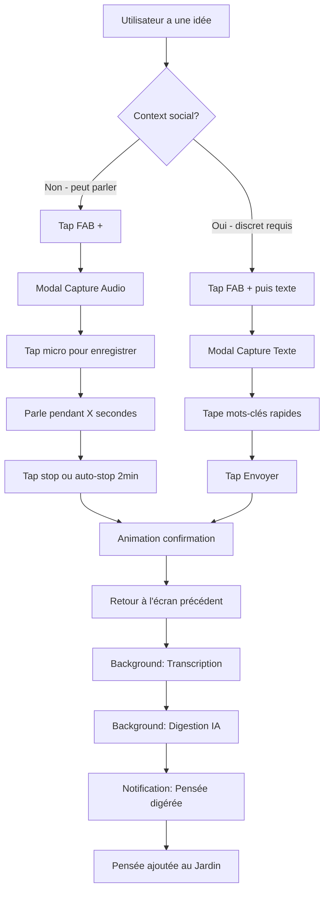
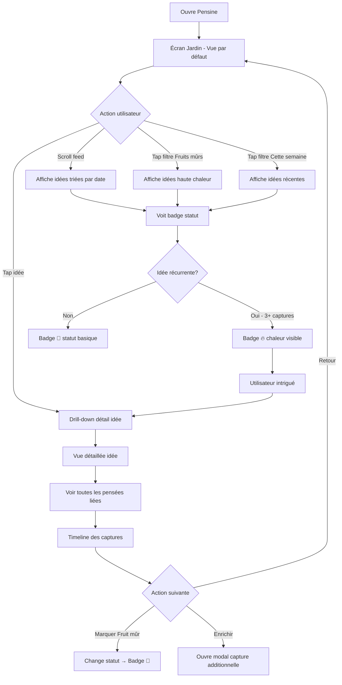
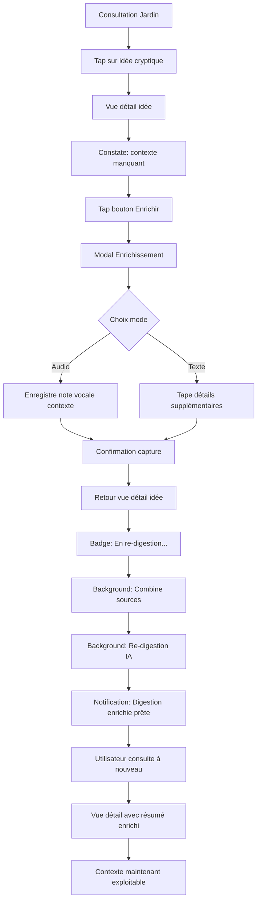

# UX Design Specification Pensine

**Author:** yohikofox
**Date:** 2026-01-09

---

<!-- UX design content will be appended sequentially through collaborative workflow steps -->

## Executive Summary

### Project Vision

**Pensine** est un incubateur personnel qui transforme les pensées vocales brutes en opportunités business concrètes.

**Philosophie fondamentale :**
> "Pensine ne capture pas ce que tu penses. Il révèle ce que tu construis sans le savoir."

**Métaphore utilisateur centrale :**
> "Je plante des graines toute la journée, puis je vais voir si des germes ont poussé."

Cette métaphore guide l'ensemble du design : la **capture est instantanée et libératrice** (plantation), la **consultation est contemplative et révélatrice** (observation des germinations).

**Différenciation clé :** Contrairement aux apps de notes (Voicenotes, AudioPen, Mem.ai) qui s'arrêtent à "retrouve tes pensées", Pensine va jusqu'à "découvre ton prochain business". L'output n'est pas des notes bien rangées, mais des **opportunités SaaS identifiées**.

### Target Users

**Persona Principal : Yoann - L'Indie Hacker/Entrepreneur**

**Profil :**
- Entrepreneur solo ou indie hacker en quête permanente d'opportunités produit
- Capture d'idées en contextes variés : en marchant, en voiture, chez soi devant YouTube, dans la rue
- Niveau technique : Intermédiaire à avancé
- Devices : Mobile-first (iOS + Android)

**Job-to-be-done :**
> "Je veux dérisquer mes idées AVANT d'investir dedans pour savoir si je me lance ou pas."

**Comportements d'usage :**
- **Volume de capture :** 5-10 captures/jour
- **Durée moyenne :** 30 secondes à 1 minute par capture
- **Contexte audio :** Environnement modérément bruyant
- **Fréquence de consultation :** Quotidienne au début, puis minimum 1x/semaine
- **Moment de consultation :** Le soir, moment calme (ex: en regardant une série)

**Pain Points :**
- Accumulation d'idées jamais évaluées - "cimetière de post-it"
- Pas de filtre pour savoir quelles idées méritent du temps
- Sentiment de "passer à côté" d'opportunités faute de dérisquage
- Ratio effort/valeur inversé : trop d'énergie AVANT de savoir si l'idée vaut quelque chose

**Besoins émotionnels :**
- **À la capture :** Soulagement, libération cognitive ("C'est capturé, j'oublie")
- **À la détection de concordance :** Excitation ("Ton cerveau te dit que c'est important !")
- **À la redécouverte :** Surprise agréable ("Ah oui ! Faut que je relance ça")

**Utilisateur Secondaire : Bastien - Destinataire Filtré (V1.5+)**
- Professionnel qui reçoit des idées **déjà pré-validées**
- Ne reçoit pas le flux brut, uniquement ce qui a survécu au dérisquage personnel
- Vecteur de viralité : "Comment tu fais pour ne m'envoyer que des idées pertinentes ?"

### Key Design Challenges

#### 1. L'Instantanéité de la Capture - "1-Tap Liberation"
**Défi :** Réduire le temps entre "j'ai une idée" et "c'est capturé" à < 1 seconde.

**Contraintes critiques :**
- Capture ultra-fluide, quasi-instantanée
- Tout en local AVANT synchronisation
- Aucune sensation "ça appelle un serveur"
- Feedback immédiat de sauvegarde locale

**Solutions à explorer :**
- Bouton de capture accessible depuis écran verrouillé
- Widget iOS/Android pour accès ultra-rapide
- Gestuelles natives (force touch, shake to record)
- Feedback haptique + visuel immédiat

#### 2. La Fluidité Offline-First
**Défi :** Aucune friction perceptible même sans réseau, en environnement mobile variable.

**Implications :**
- Architecture 100% offline-first obligatoire
- Indicateurs de statut discrets (sync en cours, en attente)
- Gestion élégante de la queue offline
- Transcription locale via Whisper on-device

**Acceptable :** Transcription différée (spinner + notification OK)

#### 3. La Qualité Audio en Environnement Bruyant
**Défi :** Assurer une transcription exploitable dans des environnements modérément bruyants (marche, voiture, rue).

**Considérations :**
- Indicateur qualité audio pendant capture (optionnel)
- Possibilité de ré-enregistrer si détection mauvaise qualité
- Fallback intelligent vers capture texte si audio raté
- Preprocessing audio pour réduction bruit

#### 4. La Notification "Concordance à Chaud"
**Défi :** Détecter ET notifier une concordance juste après capture sans être intrusif ni bloquer le flow.

**Équilibre à trouver :**
- Toast léger avec aperçu de la concordance
- Options "Voir maintenant" vs "Plus tard"
- Ne pas bloquer si utilisateur est pressé
- Créer l'excitation sans la frustration

#### 5. La Métaphore Jardin/Germination
**Défi :** Traduire visuellement "graines plantées" et "germes qui poussent" sans tomber dans le gimmick.

**Principes :**
- Visualisation de la croissance/maturité des idées
- Scoring visuel subtil (chaleur, récurrence)
- Vue "jardin" contemplative pour la consultation
- Feedback de progression sans gamification agressive

#### 6. La Gestion Consciente du Stockage
**Défi :** Donner le contrôle sur la rétention audio sans complexifier l'UX.

**Approche :**
- Rétention par défaut : ~1 semaine d'audio local
- Réglage utilisateur pour modifier la rétention
- Transparence sur l'espace utilisé
- Sync serveur pour versions premium

### Design Opportunities

#### 1. Le "1-Tap Liberation" - Geste Primal
**Opportunité :** Transformer la capture en geste addictif positif.

La capture devient un **réflexe salvateur** - dès qu'une idée surgit, un geste instinctif la libère. L'utilisateur développe une confiance absolue dans le système.

**Impact émotionnel :** Soulagement immédiat, confiance, libération mentale.

#### 2. La "Surprise Heureuse" - Moment de Plaisir
**Opportunité :** Transformer la consultation en rituel agréable de découverte.

Le moment de consultation devient **anticipé positivement** - "Qu'est-ce qui a germé aujourd'hui ?". Pas une corvée de tri, mais une exploration excitante.

**Impact émotionnel :** Anticipation positive, sérendipité, plaisir de la redécouverte.

#### 3. Le "Context Intelligence" - Partenariat IA
**Opportunité :** Utiliser les concordances comme validation émotionnelle.

Les concordances ne sont pas juste des "doublons détectés", mais des **signaux de ton cerveau** qui dit "c'est important". L'IA devient un partenaire de réflexion, pas un organisateur.

**Impact émotionnel :** Validation, confiance, sentiment d'être compris.

#### 4. La Transparence Radicale
**Opportunité :** Donner le contrôle total sur stockage, sync, données.

Pas de "boîte noire" - l'utilisateur sait où sont ses données, combien d'espace elles prennent, ce qui est synced ou non. Création d'une **confiance absolue**.

**Impact émotionnel :** Contrôle, transparence, confiance.

#### 5. L'Évolution Organique vers le Business
**Opportunité :** Accompagner naturellement de la pensée brute vers l'opportunité structurée.

Le parcours n'est pas forcé : Free tier = capture/consultation classique. Premium = scoring, brainstorm guidé, dérisquage business. L'utilisateur **choisit jusqu'où il va**.

**Impact stratégique :** Conversion naturelle free→premium basée sur la valeur perçue.

## Core User Experience

### Defining Experience

**Le cœur de Pensine repose sur deux moments fondamentaux :**

**Moment 1 : La Libération Cognitive (Capture)**
- Action primaire : Tap → Parler → Release
- Durée cible : < 1 seconde du besoin à la capture
- Émotion : Soulagement, libération ("C'est capturé, j'oublie")
- Métaphore : Planter des graines sans effort

**Moment 2 : La Révélation d'Opportunité (Germination)**
- Action centrale : Consultation contemplative des idées germées
- Le moment "aha!" critique : Découvrir qu'une opportunité business structurée et argumentée a émergé de pensées éparses
- Émotion : Surprise révélatrice ("WOW, cette opportunité vient de MES pensées et elle est prête à être travaillée")
- Métaphore : Observer les germes qui ont poussé

**Hiérarchie d'importance :**
1. **Germination intelligente** = Cœur différenciant du produit
2. **Capture fire-and-forget** = Prix d'entrée, condition nécessaire mais non suffisante

**L'expérience gagnante :**
> L'utilisateur plante 5-10 graines par jour (30s-1min chacune) en contextes variés (marche, voiture, YouTube). Le soir, moment calme, il consulte son jardin et découvre qu'une idée a germé avec récurrence détectée, contexte structuré, arguments rassemblés - potentiellement une ébauche de pitch ou mini-PRD. Le système a fait le dérisquage qu'il n'aurait jamais pris le temps de faire.

### Platform Strategy

**Plateforme Primaire : Mobile-First (iOS + Android)**

| Plateforme | Phase | Rationale |
|------------|-------|-----------|
| **iOS Native** | MVP | App Store dès V1, cœur de cible early adopters |
| **Android Native** | MVP | Play Store dès V1, parité cross-platform |
| **Web Dashboard** | V2+ | Consultation desktop, export, analytics avancés |
| **Widgets** | V1.5 | Accès ultra-rapide à la capture depuis home screen |
| **Wearables** | V3+ | Apple Watch / Wear OS pour capture contextuelle |

**Architecture Mobile :**
- React Native pour développement cross-platform
- Offline-first obligatoire (capture + transcription 100% locale)
- Whisper on-device pour transcription (confidentialité + zero latency perçue)
- Sync background transparente

**Permissions Critiques :**
- Microphone (MVP) : Capture audio
- Storage (MVP) : Cache local, fichiers audio
- Network (MVP) : Sync, digestion IA cloud
- Notifications (MVP) : Progression transcription/digestion, concordances
- Camera (V2) : Capture photo

**Contraintes Platform-Specific :**
- iOS : Respect guidelines Apple, widgets iOS 14+, potentiel Live Activities
- Android : Material Design, widgets flexibles, background tasks
- App Store compliance : Permissions justifiées, review process anticipé

### Effortless Interactions

**Les interactions qui doivent être complètement sans friction :**

#### 1. Capture Audio - "1-Tap Liberation"
**Objectif :** Temps entre "j'ai une idée" et "c'est capturé" < 1 seconde

**Exigences d'effortlessness :**
- Accès ultra-rapide (widget, lockscreen shortcut si possible)
- Feedback haptique immédiat au tap
- Pas de confirmation, pas de dialogue - tap = record
- Waveform live pour feedback visuel
- Auto-stop à la limite (ou tap pour terminer)
- Sauvegarde locale instantanée (aucune attente)

**Ce qui doit être invisible :**
- Aucune sensation "ça appelle un serveur"
- Aucun spinner pendant la capture
- Aucune latence perceptible

#### 2. Transcription Automatique
**Objectif :** Traitement transparent en background

**Exigences d'effortlessness :**
- Démarre automatiquement après capture
- Traitement local (Whisper on-device)
- Notification discrète quand terminé (optionnelle)
- Latence acceptable : < 2x durée audio
- Spinner OK pendant traitement différé

#### 3. Sync Transparente
**Objectif :** Données toujours à jour, aucune intervention utilisateur

**Exigences d'effortlessness :**
- Sync automatique au retour réseau
- Indicateurs discrets de statut (sync en cours/attente)
- Gestion élégante de la queue offline
- Résolution conflits automatique (last-write-wins MVP)
- Pas de "bouton sync" - tout automatique

#### 4. Détection de Concordance à Chaud
**Objectif :** Excitation immédiate sans interruption du flow

**Exigences d'effortlessness :**
- Toast léger post-capture si concordance détectée
- "💡 Connexion trouvée avec une idée précédente"
- Options "Voir maintenant" / "Plus tard"
- Ne bloque JAMAIS le flow si utilisateur pressé
- Disparaît automatiquement après quelques secondes

#### 5. Consultation "Jardin"
**Objectif :** Découverte paisible et contemplative

**Exigences d'effortlessness :**
- Chargement liste < 1s (cache local)
- Scroll infini fluide
- Prévisualisation riche (résumé, tags, date)
- Vue détail accessible en un tap
- Recherche intelligente (full-text + sémantique)
- Filtres simples (par tag, par maturité)

### Critical Success Moments

**Les moments make-or-break de l'expérience Pensine :**

#### Moment 1 : First Capture Success
**Timing :** Première utilisation, première minute
**Action :** L'utilisateur capture sa première pensée audio
**Émotion cible :** "C'est capturé, je peux oublier" (soulagement)

**Critères de succès :**
- Capture réussie en < 5 secondes (découverte incluse)
- Feedback immédiat et rassurant
- Toast "Pensée capturée ✓" affiché
- Aucune friction, aucune question posée

**Si échec :** L'utilisateur n'adopte pas - trop compliqué.

#### Moment 2 : First Transcription Discovery
**Timing :** Quelques minutes après première capture
**Action :** L'utilisateur consulte et voit sa transcription
**Émotion cible :** "Ça a compris ce que j'ai dit" (validation)

**Critères de succès :**
- Transcription de qualité acceptable
- Affichage clair du texte
- Audio original accessible pour vérification
- Sentiment de "ça marche"

**Si échec :** Doute sur la fiabilité du système.

#### Moment 3 : First Digestion Reveal
**Timing :** Première consultation après digestion IA
**Action :** L'utilisateur voit résumé + idées extraites
**Émotion cible :** "L'IA a compris mon intention" (surprise positive)

**Critères de succès :**
- Résumé pertinent et concis
- Idées extraites pertinentes (pas de bruit)
- Tags intelligents
- Sentiment de valeur ajoutée

**Si échec :** "C'est juste une transcription, pas mieux que Google Keep"

#### Moment 4 : First Germination "Aha!" 🌻
**Timing :** Après accumulation de quelques captures (semaine 1-2)
**Action :** L'utilisateur découvre une idée germée et argumentée
**Émotion cible :** **"MERDE, cette opportunité vient de MES pensées et elle est structurée !"** (révélation)

**Critères de succès :**
- Au moins une idée avec récurrence détectée
- Contexte structuré et arguments rassemblés
- Potentiel pitch/mini-PRD embryonnaire visible
- Signal clair de maturité/chaleur
- Sentiment : "Le système a fait le dérisquage initial"

**Si échec :** **L'adoption long-terme échoue** - Pensine devient "juste une autre app de notes"

**C'est LE moment critique qui détermine si l'utilisateur reste.**

#### Moment 5 : First Concordance Excitement
**Timing :** Capture suivante après germination
**Action :** Notification de concordance juste après capture
**Émotion cible :** "Mon cerveau me dit que c'est important !" (excitation)

**Critères de succès :**
- Toast immédiat et léger post-capture
- Aperçu de la connexion trouvée
- Pas d'interruption du flow
- Renforce le sentiment de partenariat IA

**Si échec :** Opportunité manquée de renforcer l'engagement.

### Experience Principles

**Principes directeurs pour toutes les décisions UX de Pensine :**

#### 1. Fire-and-Forget Absolu
> "La capture ne demande aucune réflexion, aucune décision, aucune friction."

**Application :**
- Jamais de dialogue de confirmation
- Jamais de sélection de catégorie pré-capture
- Jamais d'attente perceptible
- L'utilisateur doit pouvoir capturer en pilote automatique

#### 2. Offline-First Radical
> "Le réseau est un bonus, pas une dépendance."

**Application :**
- 100% des features core fonctionnent offline
- Capture + transcription locales obligatoires
- Sync transparente au retour réseau
- Aucune perte de données, jamais

#### 3. Intelligence Transparente
> "L'IA travaille pour toi, pas contre toi. Tu comprends ce qu'elle fait."

**Application :**
- Pas de "boîte noire"
- Résumés, tags, connexions explicables
- L'utilisateur peut toujours revenir aux sources (audio, transcript)
- Transparence sur stockage, sync, données

#### 4. Germination > Organisation
> "On ne range pas des notes. On révèle des opportunités."

**Application :**
- Pas de système de dossiers complexe
- Pas de tags manuels obligatoires (auto-tagging par IA)
- Focus sur détection de patterns et maturité
- La valeur = idées germées, pas notes organisées

#### 5. Évolution Organique
> "L'utilisateur choisit jusqu'où il va. Pensine ne force rien."

**Application :**
- Free tier = capture/consultation classique (déjà utile)
- Premium = scoring, brainstorm, dérisquage business (valeur supplémentaire)
- Pas de paywall artificiel sur les features core
- Conversion naturelle basée sur la valeur perçue

#### 6. Confiance Absolue
> "Aucune idée ne doit jamais être perdue. Zéro tolérance."

**Application :**
- Auto-save permanent
- Récupération après crash
- Sync avec retry automatique
- L'utilisateur doit avoir une confiance aveugle dans le système

## Desired Emotional Response

### Primary Emotional Goals

**L'expérience émotionnelle de Pensine est construite autour de trois sentiments fondamentaux :**

#### 1. Libération Cognitive (Core)
**Moment :** Pendant la capture
**Sentiment cible :** Soulagement immédiat, décharge mentale

> "C'est capturé, je peux oublier et passer à autre chose."

**Importance :** Condition sine qua non de l'adoption. Si l'utilisateur ne ressent pas cette libération instantanée, il retournera aux post-its.

#### 2. Validation Intelligente (Différenciation)
**Moment :** Détection de concordance à chaud
**Sentiment cible :** Excitation, validation émotionnelle

> "Ton cerveau te dit que c'est important !"

**Importance :** Transforme l'IA d'un simple outil en partenaire de réflexion. Crée un sentiment de complicité avec le système.

#### 3. Révélation Transformatrice (Make-or-Break) 🌻
**Moment :** Découverte d'une idée germée et argumentée
**Sentiment cible :** Émerveillement, fierté, urgence d'agir

> "MERDE, cette opportunité vient de MES pensées et elle est déjà prête à être travaillée !"

**Importance :** **LE moment émotionnel décisif.** C'est l'émotion qui différencie Pensine de toute autre app de notes. Si l'utilisateur ne ressent jamais cette révélation, l'adoption échoue.

**Hiérarchie émotionnelle :**
1. **Révélation transformatrice** = Émotion différenciante, cœur de la rétention
2. **Libération cognitive** = Émotion d'entrée, prix d'entrée
3. **Validation intelligente** = Émotion de renforcement, fidélisation

### Emotional Journey Mapping

**Le parcours émotionnel complet de l'utilisateur avec Pensine :**

| Phase | Moment | Émotion Désirée | Déclencheur Design | Émotion à Éviter |
|-------|--------|-----------------|-------------------|------------------|
| **Découverte** | Landing / Installation | Curiosité intriguée | "Découvre ce que tu construis sans le savoir" | Confusion, scepticisme |
| **Onboarding** | Premiers pas | Confiance rapide | Tutorial minimaliste, première capture en < 30s | Friction, surcharge cognitive |
| **First Capture** | 1ère utilisation | Soulagement, libération | Feedback immédiat + toast rassurant | Doute ("est-ce que c'est sauvé?") |
| **First Transcription** | Consultation J+0 | Validation du système | Transcription de qualité visible | Scepticisme ("ça a mal compris") |
| **First Digestion** | Consultation J+0/J+1 | Surprise positive | Résumé pertinent + tags intelligents | Déception ("ça n'apporte rien") |
| **Routine Capture** | Quotidien semaine 1 | Confiance croissante | Geste devient réflexe, aucune friction | Lassitude, impression de corvée |
| **First Germination** | Semaine 1-2 | **Révélation** 🌻 | Idée structurée + argumentée + récurrence | Indifférence (si mal exécuté) |
| **Concordance à Chaud** | Post-capture | Excitation, validation | Toast léger "Connexion trouvée" | Interruption agaçante |
| **Consultation Rituelle** | Régulier (soir) | Anticipation paisible | Vue jardin contemplative | Anxiété, surcharge |
| **Partage Filtré** | V1.5+ | Fierté, confiance | Idée partagée = déjà validée | Honte (partager idée non mûre) |
| **Action Lancée** | Décision de lancer | Empowerment, gratitude | Toggle "Lancé" + reconnaissance système | Abandon sans suite |

### Micro-Emotions

**Les états émotionnels subtils mais critiques à chaque interaction :**

#### Confiance vs. Confusion

**Confiance à créer :**
- Capture : "Mon audio est sauvé, même hors ligne"
- Transcription : "Le système a bien compris ce que j'ai dit"
- Sync : "Mes données sont synchronisées sans que j'aie à y penser"
- Stockage : "Je sais où sont mes données et combien d'espace elles prennent"

**Confusion à éviter :**
- Statuts ambigus (en cours de sync? transcrit ou pas?)
- Erreurs sans explication
- Comportement imprévisible offline/online

**Design implications :**
- Indicateurs de statut clairs et discrets
- Feedback immédiat à chaque action
- Messages d'erreur explicatifs et aidants
- Transparence radicale sur l'état du système

#### Excitation vs. Anxiété

**Excitation à créer :**
- Concordance détectée : "Une connexion a été trouvée !"
- Idée germée : "Découvre ce qui a émergé"
- Récurrence : "Cette idée revient souvent"
- Maturité : Signal visuel d'une idée "chaude"

**Anxiété à éviter :**
- Peur de perdre des données
- Surcharge d'informations
- Pression à "faire quelque chose" avec chaque capture
- Jugement ("cette idée est mauvaise")

**Design implications :**
- Auto-save permanent, aucune perte possible
- Présentation progressive, pas de wall of text
- Aucune obligation d'action, liberté totale
- Pas de scoring négatif, focus sur ce qui émerge

#### Accomplissement vs. Frustration

**Accomplissement à créer :**
- Capture réussie : "Pensée capturée ✓"
- Idée germée : Badge de maturité visible
- Action lancée : Toggle "Lancé" + célébration discrète
- Pattern détecté : "Tu explores ce thème depuis X jours"

**Frustration à éviter :**
- Capture qui échoue (inacceptable)
- Transcription incompréhensible
- Digestion non pertinente (bruit)
- Impossibilité de retrouver une capture

**Design implications :**
- Fiabilité absolue de la capture (offline-first)
- Qualité transcription prioritaire
- Filtres intelligents pour réduire bruit
- Recherche puissante et pertinente

#### Delight vs. Satisfaction

**Delight à créer :**
- Détection de connexion inattendue
- Pattern révélé ("Tu reviens souvent sur ce problème")
- Idée germée prête à être pitchée
- Micro-animations lors de la germination

**Satisfaction (baseline) à garantir :**
- Capture fonctionne toujours
- Transcription disponible rapidement
- Sync transparente
- Consultation fluide

**Design implications :**
- Moments de surprise dans la consultation
- Animations subtiles mais plaisantes
- Easter eggs de germination (confettis discrets?)
- Mais baseline ROCK SOLID avant tout

#### Belonging vs. Isolation

**Belonging à créer (V1.5+) :**
- Partage d'idée filtrée = fierté
- "D'autres entrepreneurs utilisent Pensine"
- Communauté de créateurs (V3+)

**Isolation à éviter :**
- Pas de "tu es seul à penser ça"
- Pas de comparaison négative
- Pas de FOMO artificiel

**Design implications :**
- Messaging inclusif
- Partage optionnel, jamais forcé
- Pas de gamification compétitive

### Design Implications

**Comment les émotions désirées se traduisent en décisions UX concrètes :**

#### Émotion → Libération Cognitive

**Approches UX :**
- Accès ultra-rapide (widget, lockscreen)
- Feedback haptique immédiat
- Toast rassurant "Pensée capturée ✓"
- Aucune confirmation, aucune question
- Auto-save transparent

**Anti-patterns à éviter :**
- Dialogues de confirmation
- Sélection de catégorie pré-capture
- Latence perceptible
- Message d'erreur sans solution

#### Émotion → Validation Intelligente

**Approches UX :**
- Toast léger post-capture si concordance
- "💡 Connexion trouvée avec [titre idée précédente]"
- Options "Voir maintenant" / "Plus tard"
- Disparition automatique (non bloquant)

**Anti-patterns à éviter :**
- Popup modal qui bloque
- Notification trop fréquente (fatigue)
- Aucun contexte sur la connexion
- Impossibilité de dismiss

#### Émotion → Révélation Transformatrice 🌻

**Approches UX :**
- Vue "Idées Germées" dédiée dans consultation
- Badge de maturité visuel (🌱 graine → 🌿 germe → 🌻 fruit)
- Résumé structuré avec arguments
- CTA clair "Lancer le brainstorm" ou "Marquer comme lancé"
- Ébauche de pitch/PRD si applicable
- Micro-célébration discrète (animation douce)

**Anti-patterns à éviter :**
- Idées germées noyées dans la liste générale
- Pas de différenciation visuelle
- Résumé trop vague ou générique
- Aucune action proposée
- Gamification agressive

#### Émotion → Anticipation Paisible (Consultation)

**Approches UX :**
- Vue "Jardin" visuelle et apaisante
- Chargement instantané (cache local)
- Scroll fluide, pas de pagination
- Filtres simples et discrets
- Prévisualisation riche

**Anti-patterns à éviter :**
- Liste austère type "inbox"
- Latence de chargement
- Surcharge visuelle
- Trop de filtres complexes
- Obligation de traiter/organiser

### Emotional Design Principles

**Principes directeurs pour créer les émotions désirées :**

#### 1. La Friction Tue la Libération
> "Chaque milliseconde de latence, chaque tap supplémentaire, tue le sentiment de libération cognitive."

**Application :**
- Obsession sur la vitesse de capture
- Élimination de toute étape non essentielle
- Feedback immédiat et rassurant
- Tolérance zéro sur les bugs de capture

#### 2. L'IA Est un Partenaire, Pas un Juge
> "L'IA révèle, suggère, connecte - elle ne juge jamais."

**Application :**
- Jamais de scoring négatif
- Pas de "cette idée est mauvaise"
- Focus sur ce qui émerge, pas ce qui manque
- Langage de partenariat ("on a trouvé", "ensemble")

#### 3. La Révélation Doit Être Gagnée, Pas Forcée
> "L'idée germée est précieuse parce qu'elle a émergé naturellement, pas parce que l'app l'a forcée."

**Application :**
- Pas de notifications "tu n'as pas consulté depuis X jours"
- Pas de pression à l'action
- La germination arrive quand elle arrive
- L'utilisateur découvre à son rythme

#### 4. La Transparence Crée la Confiance
> "L'utilisateur comprend toujours ce qui se passe avec ses données."

**Application :**
- Statuts clairs (sync, transcription, digestion)
- Explication des connexions détectées
- Contrôle total sur stockage et rétention
- Pas de "boîte noire magique"

#### 5. La Contemplation > L'Organisation
> "Observer son jardin d'idées est un plaisir, pas une corvée."

**Application :**
- Interface apaisante, pas austère
- Pas de pression à organiser/trier
- Découverte sérendipiteuse encouragée
- Consultation = moment agréable attendu

#### 6. Célébrer Discrètement, Jamais Agressivement
> "Les victoires sont célébrées avec subtilité et bon goût."

**Application :**
- Micro-animations douces
- Pas de confettis explosifs
- Pas de "BRAVO TU AS CAPTURÉ 100 IDÉES !!!"
- Reconnaissance sincère et mesurée

## UX Pattern Analysis & Inspiration

### Inspiring Products Analysis

**Produits analysés pour inspiration UX :**

#### 1. Voicenotes - Concurrent Direct Principal

**Ce qu'ils font bien :**
- Capture vocale simple et rapide
- Transcription automatique fiable
- "Ask AI" pour interroger ses notes
- Auto-tagging intelligent
- UX "second brain" vocal claire

**Patterns UX réussis :**
- Onboarding minimal, capture en quelques secondes
- Interface épurée, focus sur l'essentiel
- Connexion d'idées via AI
- Résumés automatiques

**Ce qui manque (opportunité pour Pensine) :**
- Pas d'offline (dépendance réseau totale)
- Pas de focus "opportunité business"
- Pas de scoring/maturité d'idées
- Pas de brainstorm guidé
- Métaphore "mémoire" vs "incubateur"

**Leçons pour Pensine :**
✅ À adopter : Simplicité de capture, auto-tagging, connexions IA
❌ À éviter : Dépendance réseau, absence de dérisquage business

#### 2. AudioPen - Simplicité Radicale

**Ce qu'ils font bien :**
- Transcription avec "nettoyage" (filler words supprimés)
- Super Summary concis et actionnable
- UX ultra-simple : parler → obtenir texte clair
- Pricing accessible (free tier + lifetime deal)

**Patterns UX réussis :**
- Transformation vocale → texte propre (valeur immédiate)
- Pas de complexité, une seule fonction bien faite
- Feedback visuel clair pendant enregistrement

**Ce qui manque :**
- Pas de "second brain" (notes isolées)
- Pas de connexion d'idées
- Pas d'intelligence émergente

**Leçons pour Pensine :**
✅ À adopter : Simplicité radicale de l'interface, transformation immédiate
❌ À éviter : Manque de connexions, pas d'intelligence long-terme

#### 3. Mem.ai - Organisation IA

**Ce qu'ils font bien :**
- AI qui organise et connecte automatiquement
- Pas de dossiers manuels, tout auto-tagué
- Recherche sémantique puissante
- Interface moderne et épurée

**Patterns UX réussis :**
- Zéro friction d'organisation
- Search-first UX
- Tags automatiques intelligents
- Connexions entre notes révélées

**Ce qui manque :**
- Plus orienté "notes" que "idées émergentes"
- Pas de scoring de maturité
- Pas de parcours vers action/business

**Leçons pour Pensine :**
✅ À adopter : Auto-organisation IA, search-first, connexions automatiques
❌ À éviter : Rester dans la métaphore "notes"

#### 4. Cleft Notes - Privacy & Offline-First

**Ce qu'ils font bien :**
- Transcription 100% locale (on-device)
- Privacy radical (aucune donnée cloud)
- Intégration Obsidian (export .md)
- Fonctionne offline parfaitement

**Patterns UX réussis :**
- Contrôle total sur les données
- Pas de dépendance serveur
- Export standard (markdown)

**Ce qui manque :**
- Moins d'intelligence IA
- Pas de connexions avancées
- UX plus technique

**Leçons pour Pensine :**
✅ À adopter : Offline-first absolu, transcription locale, transparence données
❌ À éviter : UX trop technique, manque d'intelligence

#### 5. Apple Notes - Simplicité Native

**Ce qu'ils font bien :**
- Intégration OS parfaite
- Capture ultra-rapide (lockscreen, widget, Siri)
- Sync iCloud transparente
- Collaboration simple

**Patterns UX réussis :**
- Accès instantané depuis n'importe où
- Zéro configuration
- Interface familière et native
- Feedback haptique et animations iOS

**Ce qui manque :**
- Aucune intelligence IA
- Pas de connexions d'idées
- Organisation manuelle uniquement

**Leçons pour Pensine :**
✅ À adopter : Accès ultra-rapide, intégration native, animations platform-specific
❌ À éviter : Manque total d'intelligence

### Transferable UX Patterns

**Patterns identifiés et applicables à Pensine :**

#### Pattern 1 : Capture "Fire-and-Forget" (Apple Notes + Voicenotes)

**Description :**
Accès ultra-rapide à la capture depuis n'importe quel contexte (lockscreen, widget, shortcut).

**Application pour Pensine :**
- Widget iOS/Android pour capture 1-tap
- Lockscreen shortcut si techniquement possible
- Integration Siri/Google Assistant (V2+)
- Force touch / long press pour capture rapide

**Valeur pour Pensine :** Supporte le principe "Fire-and-Forget Absolu"

#### Pattern 2 : Auto-Organisation IA (Mem.ai + Voicenotes)

**Description :**
Zéro friction d'organisation manuelle - l'IA tag, catégorise, et connecte automatiquement.

**Application pour Pensine :**
- Tags automatiques extraits du contenu
- Pas de système de dossiers obligatoire
- Connexions automatiques entre captures
- Clustering par thématique émergente

**Valeur pour Pensine :** Supporte le principe "Germination > Organisation"

#### Pattern 3 : Transcription Locale (Cleft Notes)

**Description :**
Processing audio 100% on-device pour privacy et zero latency perçue.

**Application pour Pensine :**
- Whisper on-device obligatoire pour MVP
- Aucune donnée audio envoyée à des tiers
- Fonctionnement offline garanti
- Confidentialité absolue

**Valeur pour Pensine :** Supporte le principe "Offline-First Radical"

#### Pattern 4 : Résumés IA Concis (AudioPen + Voicenotes)

**Description :**
Transformation contenu brut → résumé actionnable automatique.

**Application pour Pensine :**
- Résumé généré pour chaque capture
- Extraction d'idées clés (highlights)
- Structuration intelligente du contenu
- Potentiel pitch/PRD pour idées germées

**Valeur pour Pensine :** Cœur de la "Révélation Transformatrice"

#### Pattern 5 : Search-First UX (Mem.ai)

**Description :**
Recherche comme mode principal de navigation, pas la navigation hiérarchique.

**Application pour Pensine :**
- Barre de recherche proéminente
- Recherche full-text + sémantique
- Filtres intelligents (tags, maturité, date)
- Suggestions de recherche

**Valeur pour Pensine :** Supporte la "Consultation Jardin" paisible

#### Pattern 6 : Feedback Haptique & Animations (Apple Notes)

**Description :**
Feedback physique et visuel immédiat pour chaque action.

**Application pour Pensine :**
- Vibration au tap de capture
- Animation douce lors de sauvegarde
- Micro-célébrations lors de germination
- Transitions fluides iOS/Android natives

**Valeur pour Pensine :** Renforce la "Libération Cognitive"

### Anti-Patterns to Avoid

**Patterns UX à éviter absolument, identifiés dans l'analyse concurrentielle :**

#### Anti-Pattern 1 : Dépendance Réseau Totale (Voicenotes, AudioPen)

**Problème :**
Incapacité de capturer ou consulter sans connexion → frustration massive en mobilité.

**Pourquoi c'est fatal pour Pensine :**
Le moment de capture est imprévisible (marche, voiture, métro). Si le réseau manque, l'idée est perdue → trahison de la promesse "Fire-and-Forget".

**Décision Pensine :**
❌ INTERDICTION absolue de dépendre du réseau pour capture et transcription.

#### Anti-Pattern 2 : Organisation Manuelle Obligatoire (Apple Notes, Notion)

**Problème :**
Forcer l'utilisateur à choisir dossiers, tags, catégories avant ou après capture → friction cognitive.

**Pourquoi c'est fatal pour Pensine :**
Tue la "Libération Cognitive". L'utilisateur doit réfléchir à "où ranger ça" au lieu de juste capturer et oublier.

**Décision Pensine :**
❌ INTERDICTION de demander organisation manuelle. Auto-tagging IA uniquement.

#### Anti-Pattern 3 : Notifications Agressives (Apps de productivité)

**Problème :**
"Tu n'as pas consulté depuis 3 jours !" "Traite tes notes en attente !" → culpabilisation, pression.

**Pourquoi c'est fatal pour Pensine :**
Tue l'"Anticipation Paisible" de la consultation. Transforme un plaisir en corvée.

**Décision Pensine :**
❌ INTERDICTION de notifications culpabilisantes. Seules notifications acceptables : progression technique (transcription terminée) ou concordance excitante.

#### Anti-Pattern 4 : Gamification Agressive (Apps de productivité)

**Problème :**
Streaks, badges, scores, comparaisons → compétition artificielle.

**Pourquoi c'est fatal pour Pensine :**
Conflit avec le principe "Célébrer Discrètement". Pensine n'est pas un jeu, c'est un outil de réflexion sérieux.

**Décision Pensine :**
❌ INTERDICTION de gamification compétitive. Micro-célébrations discrètes uniquement.

#### Anti-Pattern 5 : Paywall sur Features Core (Freemium agressif)

**Problème :**
Bloquer la transcription, la digestion, ou la consultation derrière un paywall strict.

**Pourquoi c'est fatal pour Pensine :**
Empêche le moment "Révélation Transformatrice" de se produire en free tier → aucune conversion.

**Décision Pensine :**
❌ INTERDICTION de bloquer le core loop. Free tier doit permettre de vivre le moment "aha!" au moins une fois.

#### Anti-Pattern 6 : Interface Austère "Inbox Zero" (Apps de productivité)

**Problème :**
Interface stressante type email inbox, obligation de "traiter" chaque item.

**Pourquoi c'est fatal pour Pensine :**
Tue la métaphore "Jardin" et l'"Anticipation Paisible". Consultation devient corvée.

**Décision Pensine :**
❌ INTERDICTION d'interface type inbox. Vue jardin contemplative obligatoire.

### Design Inspiration Strategy

**Stratégie claire pour utiliser l'inspiration sans copier :**

#### À Adopter Directement

| Pattern Source | Pattern UX | Application Pensine |
|----------------|------------|---------------------|
| **Apple Notes** | Accès ultra-rapide (widget, lockscreen) | Widget iOS/Android pour capture 1-tap |
| **Cleft Notes** | Transcription locale 100% | Whisper on-device obligatoire |
| **Mem.ai** | Auto-organisation IA, zéro friction | Tags auto, pas de dossiers obligatoires |
| **Voicenotes + AudioPen** | Résumés IA concis | Résumé + extraction idées automatiques |
| **Apple ecosystem** | Feedback haptique + animations natives | Vibrations, micro-animations iOS/Android |

#### À Adapter pour Pensine

| Pattern Source | Pattern Original | Adaptation Pensine |
|----------------|------------------|-------------------|
| **Mem.ai** | Search-first navigation | Search + vue "Jardin" contemplative |
| **Voicenotes** | Connexions d'idées IA | Connexions + scoring de maturité/chaleur |
| **AudioPen** | Simplicité radicale | Simplicité capture + complexité germination |
| **Notion** | Workspaces collaboratifs | Party Mode (V1.5+) pour brainstorm guidé |

#### À Éviter Absolument

| Anti-Pattern Source | Raison d'éviter | Alternative Pensine |
|---------------------|-----------------|---------------------|
| **Voicenotes/AudioPen** | Dépendance réseau totale | Offline-first radical |
| **Apple Notes** | Aucune intelligence IA | Germination IA au cœur du produit |
| **Apps productivité** | Notifications culpabilisantes | Notifications techniques ou excitantes uniquement |
| **Apps productivité** | Gamification agressive | Célébrations discrètes et sincères |
| **Freemium agressif** | Paywall sur core features | Free tier permet moment "aha!" |
| **Email clients** | Interface austère inbox | Vue jardin contemplative |

#### Principes Directeurs d'Inspiration

**1. Emprunter les Fondations, Inventer la Différenciation**

- **Emprunter :** Capture rapide, transcription IA, auto-organisation
- **Inventer :** Germination révélatrice, scoring maturité, brainstorm guidé

**2. Adopter les Standards Platform-Specific**

- iOS : Human Interface Guidelines, haptics, animations SwiftUI
- Android : Material Design 3, gestures, animations Jetpack

**3. Adapter, Ne Pas Copier**

- Inspiration ≠ Imitation
- Chaque pattern doit servir les principes émotionnels de Pensine
- Si un pattern conflit avec un principe, le rejeter

**4. Valider par les Émotions Cibles**

Avant d'adopter un pattern, vérifier :
- ✅ Supporte-t-il la "Libération Cognitive" ?
- ✅ Renforce-t-il la "Révélation Transformatrice" ?
- ✅ Crée-t-il l'"Anticipation Paisible" ?

Si non → rejeter, même si c'est une "best practice" ailleurs.

## Design System Foundation

### Design System Choice

**Système choisi : Approche Hybride "Themeable Native"**

**React Native Paper (Material Design 3) + Composants Custom Critiques**

### Rationale for Selection

**Contexte de décision :**

| Critère | Contrainte Pensine | Impact sur choix |
|---------|-------------------|------------------|
| **Plateforme** | React Native (iOS + Android) | Besoin de composants natifs performants |
| **Équipe** | Solo developer | Besoin de vélocité, pas de temps pour full custom |
| **Timeline** | MVP focus | Vitesse de développement critique |
| **Brand** | Identité unique (métaphore jardin) | Besoin de customisation extensive |
| **Performance** | Offline-first, < 1s capture | Composants légers obligatoires |
| **Budget** | Bootstrap indie | Solutions open-source prioritaires |

**Décision : React Native Paper + Custom**

**Pourquoi React Native Paper comme base :**

✅ **Avantages critiques :**
- Material Design 3 moderne et éprouvé
- Composants natifs performants (pas de webview)
- Theming puissant (couleurs, typographie, spacing)
- Accessibilité built-in (WCAG compliant)
- Animations fluides iOS/Android
- Documentation excellente
- Community active
- **Gratuit et open-source**

✅ **Alignement avec Pensine :**
- Supporte haptics et feedback natif
- Gère dark mode nativement
- Components de base solides (Button, Card, List, FAB)
- Customisation via theme tokens
- Pas de "Material look" forcé si bien themé

❌ **Limites (gérées par custom) :**
- Pas de composants "jardin" spécifiques
- Pas de visualisation maturité/germination
- Pas de waveform audio
- Pas d'animations germination

**Stratégie : 80/20**
- **80% des composants** : React Native Paper themé
- **20% custom critiques** : Composants différenciants de Pensine

### Implementation Approach

**Phase 1 : Foundation (Setup Design Tokens)**

**1. Définir le Theme Pensine**

```javascript
// theme.js - Design Tokens Pensine
const pensineTheme = {
  // Couleurs basées métaphore jardin
  colors: {
    // Couleurs primaires (germination, croissance)
    primary: '#4CAF50',        // Vert germination
    primaryContainer: '#E8F5E9',
    onPrimary: '#FFFFFF',
    
    // Couleurs secondaires (chaleur, maturité)
    secondary: '#FF9800',      // Orange chaleur
    secondaryContainer: '#FFF3E0',
    onSecondary: '#FFFFFF',
    
    // Couleurs tertiaires (surprise, excitation)
    tertiary: '#2196F3',       // Bleu excitation
    tertiaryContainer: '#E3F2FD',
    
    // Backgrounds (calme, contemplation)
    background: '#FAFAFA',
    surface: '#FFFFFF',
    surfaceVariant: '#F5F5F5',
    
    // Feedback
    error: '#F44336',
    warning: '#FFC107',
    success: '#4CAF50',
    info: '#2196F3',
    
    // Semantic colors pour germination
    seedling: '#AED581',       // 🌱 Graine
    sprout: '#66BB6A',         // 🌿 Germe
    bloom: '#FFA726',          // 🌻 Fruit mûr
    
    // Neutrals
    onBackground: '#212121',
    onSurface: '#212121',
    outline: '#BDBDBD',
    outlineVariant: '#E0E0E0',
  },
  
  // Typographie
  fonts: {
    regular: 'System',         // iOS/Android native
    medium: 'System-Medium',
    bold: 'System-Bold',
    light: 'System-Light',
  },
  
  // Spacing (8pt grid)
  spacing: {
    xs: 4,
    sm: 8,
    md: 16,
    lg: 24,
    xl: 32,
    xxl: 48,
  },
  
  // Radius
  roundness: {
    sm: 4,
    md: 8,
    lg: 16,
    full: 9999,
  },
  
  // Animations
  animation: {
    scale: 1.0,                // Pas de ralentissement
  },
};
```

**2. Composants de Base (React Native Paper)**

| Composant | Usage Pensine | Customisation |
|-----------|---------------|---------------|
| **Button** | Actions primaires (Capturer, Continuer) | Theming couleurs + haptics custom |
| **FAB** | Bouton capture flottant | Icône micro + vibration custom |
| **Card** | Affichage captures dans liste | Elevation + badges maturité custom |
| **List.Item** | Items de consultation | Metadata + preview custom |
| **Chip** | Tags automatiques | Couleurs sémantiques custom |
| **TextInput** | Capture texte, recherche | Placeholder + feedback custom |
| **Surface** | Containers | Elevation custom |
| **ProgressBar** | Transcription, sync | Couleurs statut custom |
| **Snackbar** | Toast "Pensée capturée ✓" | Timing + haptics custom |
| **Modal** | Vues détail capture | Animations custom |

**Phase 2 : Composants Custom Critiques (20%)**

**Composants à développer from scratch :**

#### 1. WaveformVisualizer
**Usage :** Feedback visuel pendant capture audio
**Rationale :** Pas de composant Paper équivalent
**Technologie :** react-native-svg + custom animation
**Specs :** 
- Waveform live temps réel
- Animation fluide 60fps
- Couleur thème primaire

#### 2. MaturityBadge
**Usage :** Indicateur visuel de germination (🌱 → 🌿 → 🌻)
**Rationale :** Unique à Pensine, cœur de l'identité
**Technologie :** Custom component + Lottie animations
**Specs :**
- 3 états : graine, germe, fruit
- Micro-animations au changement d'état
- Couleurs semantic (seedling, sprout, bloom)

#### 3. GardenView
**Usage :** Vue contemplative de consultation
**Rationale :** Métaphore jardin unique
**Technologie :** FlatList custom + animations
**Specs :**
- Scroll fluide avec prévisualisation riche
- Clustering visuel par thématique
- Transitions douces entre états

#### 4. ConcordanceToast
**Usage :** Notification légère de concordance détectée
**Rationale :** Timing et UX spécifiques
**Technologie :** Custom component + react-native-reanimated
**Specs :**
- Apparition douce depuis le haut
- Auto-dismiss après 3s
- Actions "Voir maintenant" / "Plus tard"
- Haptic feedback

#### 5. GerminationCelebration
**Usage :** Micro-célébration lors de germination détectée
**Rationale :** Moment émotionnel clé unique
**Technologie :** Lottie animation + confetti discrets
**Specs :**
- Animation subtile et élégante
- Pas de "explosion" agressive
- Délai discret, pas de blocage

### Customization Strategy

**Stratégie de Personnalisation en 3 Niveaux :**

#### Niveau 1 : Theming Global (Material Design 3 Tokens)

**Application :**
- Couleurs complètes custom (palette jardin)
- Typographie native iOS/Android
- Spacing cohérent (8pt grid)
- Dark mode full support
- Accessibility contrast compliant

**Effort :** Faible (configuration)
**Impact :** Identité visuelle de base

#### Niveau 2 : Component-Level Customization

**Application :**
- Surcharge styles composants Paper (Button, Card, etc.)
- Ajout de haptic feedback custom
- Animations spécifiques Pensine
- Metadata displays custom (date, durée, statut)

**Effort :** Moyen (wrapping + enhancement)
**Impact :** Polish et cohérence

#### Niveau 3 : Composants Custom Uniques

**Application :**
- 5 composants critiques développés from scratch
- Animations complexes (Lottie, Reanimated)
- Interactions uniques (waveform, germination)

**Effort :** Élevé (développement custom)
**Impact :** Différenciation totale

**Distribution de l'effort :**
- Niveau 1 : 10% du temps design
- Niveau 2 : 30% du temps design
- Niveau 3 : 60% du temps design

**Priorisation :**
1. **MVP :** Niveau 1 complet + WaveformVisualizer + MaturityBadge
2. **V1.5 :** Niveau 2 complet + GardenView
3. **V2+ :** Niveau 3 complet (tous composants custom)

### Design Tokens Structure

**Organisation des tokens :**

```
/design-system
  /tokens
    - colors.js          # Palette complète
    - typography.js      # Fonts, sizes, weights
    - spacing.js         # Grid 8pt
    - radius.js          # Border radius
    - elevation.js       # Shadows iOS/Android
    - animations.js      # Timings, easings
  /theme
    - light-theme.js     # Theme clair
    - dark-theme.js      # Theme sombre
  /components
    /base                # React Native Paper (wrapped)
      - Button.jsx
      - Card.jsx
      - FAB.jsx
      ...
    /custom              # Composants uniques Pensine
      - WaveformVisualizer.jsx
      - MaturityBadge.jsx
      - GardenView.jsx
      - ConcordanceToast.jsx
      - GerminationCelebration.jsx
```

### Accessibility Compliance

**Standards respectés :**

| Standard | Niveau | Application |
|----------|--------|-------------|
| **WCAG 2.1** | AA minimum | Contraste couleurs, tailles texte, touch targets |
| **iOS HIG** | Full compliance | Haptics, animations, gestures natives |
| **Android Material** | Design 3 compliant | Elevation, ripple, state layers |

**Features accessibilité :**
- **VoiceOver / TalkBack** : Labels sémantiques sur tous composants
- **Dynamic Type** : Texte s'adapte aux préférences utilisateur
- **Reduce Motion** : Animations désactivables
- **Color Contrast** : Minimum 4.5:1 (AA)
- **Touch Targets** : Minimum 44x44pt (iOS) / 48x48dp (Android)
- **Focus Indicators** : Visibles et cohérents

### Performance Considerations

**Optimisations design system :**

| Aspect | Optimisation | Impact Pensine |
|--------|--------------|----------------|
| **Bundle Size** | Tree-shaking composants Paper | Import uniquement nécessaire |
| **Rendering** | Memoization composants custom | 60fps garanti |
| **Animations** | react-native-reanimated (native thread) | Pas de frame drops |
| **Images** | SVG pour icônes, optimized PNGs | Taille minimale |
| **Fonts** | System fonts (pas de custom fonts) | Zero loading time |

**Budget performance :**
- Capture screen render : < 16ms (60fps)
- Animation germination : < 500ms total
- Theme switching : < 100ms perçu

### User Mental Model

**Métaphore Fondatrice : Le Jardin Personnel**

L'utilisateur n'a pas un modèle mental de "prise de notes" ou "inbox à traiter", mais celui d'un **jardin qu'il cultive sans effort**.

**Mental Model Map :**

| Métaphore Jardin | Action Utilisateur | Attente Système |
|------------------|-------------------|-----------------|
| **Planter des graines** | Capture vocale rapide | Sauvegarde instantanée, aucune friction |
| **Arroser** | Ne rien faire (automatique) | Digestion IA en background |
| **Observer la croissance** | Consultation contemplative | Visualisation maturité/germination |
| **Récolter** | Export opportunité structurée | Pitch/PRD embryonnaire prêt |

**Rupture avec modèles existants :**

**❌ Modèle "Notes App" (Voicenotes, Apple Notes) :**
- Mental model : "Je capture pour retrouver plus tard"
- Output : Transcription, recherche
- Limite : Aucune intelligence, l'utilisateur fait tout le travail

**❌ Modèle "Second Brain" (Mem.ai, Notion) :**
- Mental model : "Je structure ma connaissance"
- Output : Base de connaissance organisée
- Limite : Effort cognitif élevé, friction à la capture

**✅ Modèle Pensine "Personal Incubator" :**
- Mental model : "Je plante des graines brutes, je récolte des opportunités structurées"
- Output : Idées dérisquées avec arguments et contexte
- Différence : **L'IA fait le travail initial que tu ne ferais jamais**

**Expectations vs. Reality :**

| Attente Initiale | Réalité Pensine |
|------------------|-----------------|
| "Une autre app de notes vocales" | "Un partenaire IA qui détecte mes patterns de pensée" |
| "Je vais devoir trier mes idées" | "Le système me dit quelles idées méritent mon attention" |
| "Je dois structurer mes pensées" | "Je peux parler brut, le système structure pour moi" |
| "Ça va finir en cimetière de notes" | "Les idées germées survivent, les autres s'effacent naturellement" |

**Confusion Potentielle & Mitigation :**

| Point de Confusion | Risque | Mitigation UX |
|--------------------|--------|---------------|
| "C'est quoi une 'germination' ?" | Jargon opaque | Onboarding visuel avec exemple concret |
| "Pourquoi certaines idées ont plus de 'chaleur' ?" | Scoring mystérieux | Tooltip explicatif : "Récurrence + contexte = chaleur" |
| "L'IA va-t-elle tout analyser ?" | Inquiétude confidentialité | Transparence : "Analyse locale d'abord, cloud optionnel" |
| "Mes audios sont-ils stockés ?" | Inquiétude stockage/privacy | Settings clairs : Rétention audio configurable |

### Success Criteria

**Critères de Succès pour l'Expérience Core**

Ces critères définissent ce qui fait qu'un utilisateur dira **"Pensine, ça change la donne"** vs. **"C'est juste une app de notes de plus"**.

#### Capture Experience Success

| Critère | Mesure Objectif | Ressenti Utilisateur |
|---------|-----------------|----------------------|
| **Vitesse** | < 1s du besoin à l'enregistrement | "Instantané, libérateur" |
| **Feedback Immédiat** | Haptic + visuel < 100ms | "Je sens que c'est capturé" |
| **Zero Friction** | 0 dialogue, 0 confirmation | "Fire-and-forget, je peux oublier" |
| **Fiabilité Offline** | 100% capture locale sans réseau | "Ça marche partout, toujours" |
| **Qualité Audio** | Transcription exploitable (>85% WER) | "Ça a compris ce que j'ai dit" |

**Feedback de Succès :**
- ✅ Haptic vibration au tap
- ✅ Waveform animée pendant capture
- ✅ Toast "Pensée capturée ✓" post-enregistrement
- ✅ Badge de progression transcription (spinner discret)

#### Germination Experience Success

| Critère | Mesure Objectif | Ressenti Utilisateur |
|---------|-----------------|----------------------|
| **Pertinence** | >80% germinations jugées "intéressantes" | "Le système capte vraiment mes patterns" |
| **Surprise Positive** | Découverte au moins 1 germination/semaine | "Wow, je n'avais pas vu la connexion" |
| **Structuration** | Arguments + contexte visibles | "C'est déjà une ébauche de pitch" |
| **Actionabilité** | Utilisateur peut agir (creuser/exporter) | "Je sais quoi faire avec ça" |
| **Timing** | Détection concordance < 24h post-capture | "C'est encore frais dans ma tête" |

**Feedback de Succès :**
- 🌱 Badge visuel de maturité (seedling → sprout → bloom)
- 🔥 Indicateur de "chaleur" (récurrence détectée)
- 💡 Toast concordance à chaud si détectée immédiatement
- 📊 Vue "Jardin" avec tri par maturité/chaleur

#### "Aha!" Moment Success (Critical)

**Le moment critique qui convertit un utilisateur sceptique en advocate :**

**Timing :** Semaine 1-2 d'utilisation (5-10 captures minimum)

**Déclencheur :**
L'utilisateur consulte son jardin et découvre qu'une opportunité business structurée a émergé de ses pensées brutes éparpillées.

**Critères du "Aha!" réussi :**

| Élément | Quoi | Impact |
|---------|------|--------|
| **Récurrence Visible** | Au moins 3 captures liées détectées | "J'y pensais vraiment souvent" |
| **Contexte Structuré** | Tags, résumé consolidé, timeline | "Le système a rassemblé les morceaux" |
| **Arguments Rassemblés** | Points pour/contre, insights | "C'est déjà un début de dérisquage" |
| **Pitch Embryonnaire** | Structure PRD/pitch visible | "Je peux partager ça à quelqu'un" |
| **Signal de Maturité** | Badge "🌻 Fruit mûr" | "Cette idée mérite mon attention" |

**Ressenti cible :**
> "MERDE. Cette opportunité vient de MES pensées et elle est déjà structurée. Le système a fait le boulot de dérisquage initial que je n'aurais JAMAIS pris le temps de faire."

**Si ce moment échoue :**
- L'utilisateur voit juste une liste de transcriptions → "C'est Google Keep avec IA"
- Abandon probable sous 2 semaines
- Pas de recommandation virale

**Si ce moment réussit :**
- L'utilisateur devient advocate → "Tu DOIS essayer ça"
- Adoption long-terme probable
- Conversion premium facilitée (veut plus de germinations)

#### Fast vs. Automatic Decision Criteria

**Principe de design :** Certaines choses doivent être **rapides** (fast feedback), d'autres **automatiques** (pas de décision).

**FAST (User Action Required) :**

| Action | Temps Cible | Rationale |
|--------|-------------|-----------|
| Tap to capture | < 1s | Intentionnalité, user en contrôle |
| Voir concordance (optionnel) | < 2s | Choix "maintenant" ou "plus tard" |
| Consulter jardin | < 1s load | Gratification immédiate |
| Export opportunité | < 3s | Action finale, acceptable |

**AUTOMATIC (Zero User Input) :**

| Processus | Timing | Feedback |
|-----------|--------|----------|
| Transcription | Background (< 2x audio) | Notification discrète optionnelle |
| Digestion IA | Background cloud | Badge "En cours" puis "Prêt" |
| Sync | Background automatique | Indicateur discret statut |
| Détection concordance | Post-digestion | Toast à chaud si trouvée |
| Scoring maturité | Continu en background | Mise à jour badges automatique |

**Règle d'Or :**
> Si l'utilisateur **doit** choisir, c'est **fast**. Si le système **peut** décider, c'est **automatic**.

### Novel UX Patterns

**Patterns Innovants Pensine vs. Établis**

Analyse de ce qui est **novel** (nécessite éducation utilisateur) vs. **established** (utilisateur connaît déjà).

#### Pattern 1 : Concordance à Chaud 🔥

**Type :** 🆕 **Novel** - Pas d'équivalent dans apps de notes classiques

**Description :**
Juste après capture, si l'IA détecte une connexion avec une pensée précédente, toast immédiat avec aperçu.

**Exemple concret :**
```
Utilisateur vient de capturer : "Je me demande si une app pour gérer les tâches ménagères aurait du sens..."

Toast apparaît 2s après :
💡 Connexion trouvée avec une idée précédente
"Il y a 3 jours, tu as parlé d'automatiser la maison"
[Voir maintenant] [Plus tard]
```

**Pourquoi c'est novel :**
- Les apps de notes détectent des doublons APRÈS recherche manuelle
- Pensine détecte des **connexions sémantiques** de façon **proactive**
- Le timing (à chaud, juste après capture) crée l'excitation

**Éducation Utilisateur :**
- Onboarding : "Pensine te signale quand tu penses plusieurs fois à quelque chose"
- Première fois : Tooltip explicatif + haptic
- Progressive disclosure : Apparaît seulement quand pertinent

**Risques :**
- ❌ Trop de faux positifs → Fatigue notification
- ❌ Toast intrusif → Frustration si utilisateur pressé

**Mitigation :**
- ✅ Seuil de confiance élevé (>80% similarité sémantique)
- ✅ Toast disparaît auto après 5s
- ✅ Option "Pas maintenant" accessible
- ✅ Setting pour désactiver concordances à chaud

#### Pattern 2 : Vue Jardin Contemplative 🌱

**Type :** 🆕 **Novel + Twist** - Métaphore jardin sur interface classique

**Description :**
Contrairement aux listes chronologiques (Voicenotes) ou aux arbres de connaissance (Notion), Pensine présente les idées comme un **jardin organique** avec visualisation de maturité.

**Interface :**
```
[Vue Jardin]

🌻 Fruit mûr (3)      ← Idées germées, haute maturité
└─ "App ménage automatisé" 🔥🔥🔥 (7 captures, 12 jours)
└─ "Plugin Claude Code pour..." 🔥🔥 (4 captures, 5 jours)

🌿 En germination (5)  ← Récurrence détectée, maturité moyenne
└─ "Newsletter technique..." 🔥 (2 captures, 3 jours)

🌱 Graines (23)        ← Captures isolées, faible maturité
└─ "Idée random marketing..." (1 capture, aujourd'hui)
```

**Pourquoi c'est novel :**
- Tri par **maturité organique** (pas date/alpha)
- Visualisation **croissance** vs. statique
- Métaphore **contemplative** vs. productive

**Twist sur pattern établi :**
- Base = Liste avec filtres (établi)
- Twist = Tri par germination + badges visuels organiques (novel)

**Éducation Utilisateur :**
- Onboarding : "Tes idées poussent comme des plantes"
- First-time UX : Tooltip sur badges (🌱 → 🌿 → 🌻)
- Metaphor reinforcement : Micro-animations de croissance

**Risques :**
- ❌ Métaphore pas comprise → Confusion
- ❌ Trop "mignon" → Pas pris au sérieux

**Mitigation :**
- ✅ Fallback vue liste classique disponible
- ✅ Tooltips explicatifs sur badges
- ✅ Design sobre, pas cartoon

#### Pattern 3 : Scoring de Chaleur Contextuel 🔥

**Type :** 🆕 **Novel** - Scoring émergent vs. tags manuels

**Description :**
Contrairement aux apps qui demandent tags/priorités manuelles, Pensine calcule automatiquement la **"chaleur"** d'une idée basée sur récurrence + contexte.

**Calcul Chaleur :**
```
Chaleur = f(récurrence, temps_entre_captures, contextes_variés, engagement)

Exemples :
🔥🔥🔥 = 5+ captures sur 2 semaines, contextes variés
🔥🔥   = 3-4 captures sur 1 semaine
🔥     = 2 captures détectées
∅      = Capture isolée
```

**Affichage :**
```
📱 App ménage automatisé 🔥🔥🔥
└─ 7 pensées liées • 12 jours • Contextes : marche, voiture, maison
```

**Pourquoi c'est novel :**
- **Zero effort utilisateur** - pas de tagging manuel
- **Signal émergent** - la récurrence révèle l'importance
- **Validation émotionnelle** - "Ton cerveau te dit que c'est important"

**Éducation Utilisateur :**
- Onboarding : "Plus tu penses à quelque chose, plus ça chauffe 🔥"
- Tooltip : "Chaleur = combien de fois tu en parles + diversité contextes"
- Progressive : Badges apparaissent seulement quand pertinent

**Risques :**
- ❌ Calcul opaque → "Pourquoi c'est chaud ?"
- ❌ Pas de contrôle → Frustration

**Mitigation :**
- ✅ Tooltip explicatif sur tap (montre calcul détaillé)
- ✅ Possibilité pin/unpin manuel (override scoring)
- ✅ Transparence : "7 captures • 12 jours"

#### Pattern 4 : Germination Révélation 🌻

**Type :** 🆕🆕 **Highly Novel** - Le cœur différenciant de Pensine

**Description :**
Une **opportunité structurée** émerge automatiquement de pensées brutes éparpillées. L'utilisateur ne fait PAS le travail de connexion - l'IA le fait.

**Flow de Germination :**
```
Jour 1 : Capture "App pour gérer les corvées, c'est relou de se rappeler"
Jour 3 : Capture "Automation maison, genre aspirateur mais pour toute la maison"
Jour 7 : Capture "Les gens paient pour ne pas réfléchir aux tâches répétitives"

→ IA détecte récurrence thématique
→ Digestion avancée : extraction arguments, contexte, insights
→ Germination 🌻 créée automatiquement

[Résultat affiché :]
🌻 Opportunité détectée : App automatisation tâches ménagères

Résumé : Tu explores l'idée d'une app qui automatise la gestion mentale des corvées domestiques, en capitalisant sur la volonté des gens de payer pour réduire leur charge cognitive.

Arguments pour :
• Récurrence élevée (3 pensées en 1 semaine)
• Problème personnel ressenti (frustration tâches)
• Insight marché : "Gens paient pour ne pas réfléchir"

Contexte :
• Inspirations : Aspirateurs robots, automatisation maison
• Pain point : Charge mentale, se souvenir des corvées
• Timing : 7 jours de maturation

Next Steps suggérés :
1. Brainstorm problèmes spécifiques (lessive, poubelles, etc.)
2. Recherche concurrence (apps existantes ?)
3. Valider : Combien les gens paieraient ?
```

**Pourquoi c'est **highly novel** :**
- ❌ Aucune app ne fait ça actuellement
- ❌ Requiert IA avancée (pas juste NLP simple)
- ❌ Change fondamentalement le job-to-be-done

**Comparaison :**
| App | Output | Effort Utilisateur |
|-----|--------|-------------------|
| Voicenotes | Transcriptions | 100% (tout le travail de synthèse) |
| Mem.ai | Knowledge base | 80% (tagging, connexions manuelles) |
| **Pensine** | **Opportunité structurée** | **20%** (l'IA fait dérisquage initial) |

**Éducation Utilisateur (Critical) :**
- **Onboarding obligatoire** : Vidéo/animation montrant exemple germination
- **First germination** : Celebration visuelle + tutorial
- **Empty state** : "Continue à planter des graines. Une germination apparaîtra quand ton cerveau pensera plusieurs fois à quelque chose."

**Risques :**
- ❌❌ **Plus grand risque Pensine** : Utilisateur ne comprend pas la valeur
- ❌ Germinations pas assez pertinentes → "C'est random"
- ❌ Trop long à apparaître → Abandon avant "aha!"

**Mitigation :**
- ✅ Seeding initial : Première germination déclenchée rapidement (seuil bas initial)
- ✅ Transparence : Montrer "7 pensées liées" pour légitimer
- ✅ Feedback loop : "Cette germination t'intéresse ?" (Y/N) → Améliore scoring
- ✅ Progressive enhancement : Free tier = germinations simples, Premium = dérisquage avancé

#### Patterns Établis (Reassurance)

**Ce qui reste familier :**

| Pattern Établi | Application Pensine | Bénéfice |
|----------------|-------------------|----------|
| Liste scrollable | Vue jardin scrollable | Zero courbe apprentissage |
| Tap to open detail | Tap sur idée → Vue détail | Intuitif immédiatement |
| Swipe actions | Swipe → Archive/Pin/Delete | Gestes connus |
| Search bar | Recherche full-text + sémantique | Pas de réinvention de la roue |
| Notifications | Transcription ready, germination | Familier, attendu |
| Settings | Permissions, rétention, sync | Standard |

**Règle d'Or :**
> Innove là où ça crée de la valeur unique (germination). Reste établi partout ailleurs (navigation, actions basiques).

### Experience Mechanics

**Détail des Mécaniques d'Interaction Core**

#### Mécanique 1 : Capture "Fire-and-Forget"

**Flow détaillé :**

```
[INITIATION]
├─ Trigger 1 : Widget home screen → Tap direct
├─ Trigger 2 : App icon → Ouvre direct sur capture
├─ Trigger 3 : Lockscreen shortcut (iOS)
└─ Trigger 4 : Force touch icon (iOS) / Long press (Android)

[INTERACTION]
├─ Tap on "Capture" → Haptic feedback (100ms)
├─ Waveform visualizer apparaît immédiatement
├─ Enregistrement démarre automatiquement (pas de "Record" button)
├─ Audio waveform animée en temps réel
├─ Durée affichée (0:00 → 0:30 → ...)
└─ Limite : Auto-stop à 2 min OU tap "Terminer"

[FEEDBACK]
├─ Pendant : Waveform + durée + niveau audio
├─ Fin tap : Haptic confirmation
├─ Post-enregistrement : 
│   ├─ Toast "Pensée capturée ✓" (2s)
│   ├─ Badge "Transcription en cours..." (si on-device)
│   └─ Toast concordance (si détectée < 3s)
└─ Visual : Capture ajoutée en haut de la liste (local immédiat)

[COMPLETION]
├─ Sauvegarde locale instantanée (SQLite + fichier audio)
├─ Sync queue (background, transparent)
├─ Transcription Whisper on-device démarre
└─ Return to context : Utilisateur peut quitter, tout continue en background
```

**États d'erreur & Recovery :**

| Erreur | Feedback | Recovery |
|--------|----------|----------|
| Permission micro refusée | Alert "Pensine a besoin du micro" + Settings link | Relance après permission |
| Stockage plein | Alert "Espace insuffisant" + libération suggestions | Cleanup ou annulation |
| Audio vide (pas de son) | Toast "Aucun son détecté" + option "Réessayer" | Re-record ou annuler |
| Transcription failed | Badge "Erreur transcription" + option "Retry" | Retry ou garder audio seul |

**Optimisations UX :**
- ✅ Pas de compte-à-rebours "3, 2, 1" - démarre immédiatement
- ✅ Pas de dialogue confirmation - auto-save
- ✅ Pas de "Titre" demandé - auto-généré depuis transcription
- ✅ Pas de tags manuels - auto-extraits par IA

#### Mécanique 2 : Consultation Jardin

**Flow détaillé :**

```
[INITIATION]
├─ App launch → Vue jardin par défaut
├─ Tab "Jardin" depuis n'importe où
└─ Pull-to-refresh pour sync manuelle (optionnel)

[INTERACTION - Vue Liste]
├─ Chargement : 
│   ├─ Cache local (< 500ms)
│   └─ Sync background si réseau
├─ Affichage :
│   ├─ Tri par défaut : Maturité (🌻 → 🌿 → 🌱)
│   ├─ Cards avec preview :
│   │   ├─ Badge maturité (🌻/🌿/🌱)
│   │   ├─ Badge chaleur (🔥🔥🔥 / ∅)
│   │   ├─ Résumé (1 ligne)
│   │   ├─ Tags (3 max affichés)
│   │   └─ Metadata (date, durée si audio, nb captures liées)
│   └─ Scroll infini fluide
└─ Actions :
    ├─ Tap card → Vue détail
    ├─ Swipe right → Pin
    ├─ Swipe left → Archive
    └─ Long press → Menu contextuel

[FEEDBACK]
├─ Loading state : Skeleton cards (pas de spinner vide)
├─ Empty state : 
│   ├─ "Aucune germination encore 🌱"
│   ├─ "Continue à capturer - les connexions apparaîtront"
│   └─ Illustration encourageante
├─ Sync indicator : 
│   └─ Petit badge "Sync..." en haut (discret)
└─ Pull-to-refresh feedback : Haptic + animation

[COMPLETION]
└─ Tap card → Transition vers vue détail (slide up)
```

**Filtres & Search :**

```
[Barre Search]
├─ Full-text : Recherche transcriptions
├─ Sémantique : "app pour automatiser" → trouve "corvées automatiques"
└─ Tags : #productivity #saas

[Filtres Rapides]
├─ 🌻 Fruits mûrs seulement
├─ 🔥 Chaleur élevée (>= 🔥🔥)
├─ 📅 Cette semaine
├─ 🎤 Audio seulement (vs texte)
└─ ⭐ Pinned
```

#### Mécanique 3 : Découverte Germination

**Flow détaillé :**

```
[INITIATION - Passive Discovery]
├─ Notification :
│   ├─ "🌻 Une idée a germé : App automatisation tâches ménagères"
│   └─ Tap notification → Ouvre germination directement
├─ Badge :
│   └─ Badge "1" sur tab Jardin si germination non vue
└─ In-app :
    └─ Card germination apparaît en haut avec badge "NEW"

[INTERACTION - Vue Germination Détail]
├─ Header :
│   ├─ Badge 🌻 + "Fruit mûr"
│   ├─ Titre auto-généré : "App automatisation tâches ménagères"
│   ├─ Metadata : "7 pensées liées • 12 jours • 🔥🔥🔥"
│   └─ Tags : #productivity #automation #saas
│
├─ Section "Résumé" :
│   └─ Paragraph synthétique de l'opportunité
│
├─ Section "Arguments Pour" :
│   ├─ Bullet points extraits des captures
│   └─ Ex: "Récurrence élevée (7 pensées en 12 jours)"
│
├─ Section "Contexte" :
│   ├─ Inspirations mentionnées
│   ├─ Pain points identifiés
│   └─ Timing/patterns observés
│
├─ Section "Pensées Liées" (Expandable) :
│   ├─ Liste des 7 captures sources
│   ├─ Timeline visuelle
│   └─ Tap sur capture → Ouvre détail capture
│
└─ Actions :
    ├─ [Brainstorm] → Lance brainstorm guidé (Premium)
    ├─ [Exporter] → Export MD/PDF/partage
    ├─ [Archiver] → Archive germination
    └─ [⋮ More] → Pin, tags manuels, etc.

[FEEDBACK]
├─ First-time :
│   ├─ Overlay tutorial : "Voici ta première germination !"
│   ├─ Walkthrough des sections
│   └─ Celebration animation 🎉
├─ Subsequent :
│   └─ Standard card tap → detail view
└─ Engagement tracking :
    └─ "Cette germination t'intéresse ?" (👍/👎) → Améliore scoring IA

[COMPLETION]
├─ Mark as viewed (badge disparaît)
├─ Tracking : Time spent, actions prises
└─ Return : Back button → Retour jardin
```

**Celebration First Germination (Critical) :**

```
[Animation Sequence - First Time Only]
├─ Step 1 : Screen overlay semi-transparent
├─ Step 2 : Germination card grossit (scale animation)
├─ Step 3 : Confetti animation légère 🎉
├─ Step 4 : Toast :
│   └─ "🌻 Première germination ! Ton cerveau a parlé plusieurs fois de cette opportunité."
├─ Step 5 : Micro-tutorial :
│   ├─ Highlight "Pensées liées" → "7 captures connectées"
│   ├─ Highlight "Arguments" → "Insights extraits automatiquement"
│   └─ Highlight "Next Steps" → "Suggestions pour creuser"
└─ Step 6 : CTA : [Découvrir] → Ferme overlay, permet exploration

Durée totale : ~5-7s
Skippable : Oui (tap outside)
```

#### Mécanique 4 : Concordance à Chaud

**Flow détaillé :**

```
[INITIATION - Post-Capture]
├─ Capture terminée → Transcription démarre
├─ Digestion rapide (< 3s) :
│   ├─ Embedding vectoriel de la capture
│   └─ Similarité cosine avec captures récentes (7 derniers jours)
└─ Si match > 80% similarité :
    └─ Toast concordance triggered

[INTERACTION - Toast Concordance]
├─ Appearance :
│   ├─ Toast slide from top (haptic)
│   ├─ Icône 💡
│   ├─ Message : "Connexion trouvée avec une idée précédente"
│   ├─ Preview : "Il y a 3 jours : 'Automation maison...'" (1 ligne max)
│   └─ Actions : [Voir maintenant] [Plus tard]
│
├─ Interaction :
│   ├─ Tap "Voir maintenant" :
│   │   └─ Ouvre vue détail capture + capture liée affichée
│   ├─ Tap "Plus tard" :
│   │   └─ Toast disparaît, marqué "à revoir"
│   ├─ Tap outside / Swipe up :
│   │   └─ Toast disparaît (pas marqué)
│   └─ Auto-dismiss :
│       └─ Après 5s, toast disparaît automatiquement
│
└─ Badge persistence :
    └─ Si "Plus tard" → Badge sur capture dans jardin

[FEEDBACK]
├─ Visual :
│   ├─ Toast avec shadow légère
│   ├─ Animation slide smooth
│   └─ Preview texte tronqué intelligemment
├─ Haptic :
│   └─ Pattern distinct (double tap haptic)
└─ Sound (optionnel dans settings) :
    └─ Chime discret

[COMPLETION]
├─ Si "Voir maintenant" :
│   ├─ Mark concordance as viewed
│   └─ Tracking : User engaged immédiatement
├─ Si "Plus tard" :
│   ├─ Badge persiste sur card jardin
│   └─ Réapparaît dans vue détail capture
└─ Si dismissed :
    └─ Concordance reste détectable mais pas notifiée à nouveau
```

**Settings Utilisateur :**

| Setting | Options | Défaut |
|---------|---------|--------|
| Concordances à chaud | ON / OFF | ON |
| Seuil détection | Strict / Normal / Permissif | Normal (80%) |
| Son notification | ON / OFF | OFF |
| Haptic feedback | ON / OFF | ON |

#### Mécanique 5 : Transcription & Digestion Background

**Flow détaillé :**

```
[INITIATION - Post-Capture Auto]
└─ Capture saved → Transcription queue triggered

[INTERACTION - Transcription (On-Device)]
├─ Process :
│   ├─ Whisper model (small/medium selon device)
│   ├─ Input : Audio file local
│   └─ Output : Texte brut + timestamps
│
├─ Timing :
│   ├─ Cible : < 2x durée audio (30s audio = 60s transcription)
│   └─ Background thread (ne bloque pas UI)
│
├─ Feedback UI :
│   ├─ Badge "Transcription en cours..." sur card
│   ├─ Spinner discret
│   └─ Notification optionnelle quand terminé
│
└─ Completion :
    ├─ Badge "✓ Transcrit"
    ├─ Texte disponible dans vue détail
    └─ Digestion IA triggered

[INTERACTION - Digestion IA (Cloud)]
├─ Process :
│   ├─ LLM call (GPT-4-mini ou équivalent)
│   ├─ Input : Transcription + contexte (captures récentes)
│   └─ Output :
│       ├─ Résumé (1-2 phrases)
│       ├─ Tags auto-générés (3-5)
│       ├─ Idées extraites (bullet points)
│       ├─ Embedding vectoriel (pour similarité)
│       └─ Scoring initial (maturité, chaleur)
│
├─ Timing :
│   ├─ Cible : < 5s (API call)
│   └─ Background, non-bloquant
│
├─ Feedback UI :
│   ├─ Badge "Digestion..." sur card
│   ├─ Puis badge "✓ Prêt" quand terminé
│   └─ Pas de notification (sauf si concordance détectée)
│
└─ Completion :
    ├─ Résumé + tags affichés dans preview
    ├─ Détection concordance executed
    └─ Scoring maturité updated

[ÉTATS & RECOVERY]
├─ Offline :
│   ├─ Transcription : Continue (on-device)
│   ├─ Digestion : Queue jusqu'à retour réseau
│   └─ Badge : "En attente de connexion"
│
├─ Erreur transcription :
│   ├─ Badge "Erreur transcription"
│   ├─ Option "Réessayer"
│   └─ Fallback : Audio reste accessible
│
└─ Erreur digestion :
    ├─ Badge "Erreur analyse"
    ├─ Retry auto (3x max)
    └─ Fallback : Résumé basique (premiers mots transcription)
```

**Indicators visuels progressifs :**

```
État Capture :
├─ 🎤 "Enregistré" (immédiat)
├─ ⏳ "Transcription..." (on-device, ~1min)
├─ ⚙️ "Analyse..." (cloud, ~5s)
├─ ✓ "Prêt" (terminé)
└─ 💡 "Concordance trouvée" (si applicable)
```

---

**Fin du Step 7 Content**


## Visual Design Foundation

### Brand Identity : "Liquid Memory"

**Concept Central :**
Les pensées sont comme un liquide précieux qui se stocke, se mélange, crée des reflets et des profondeurs. La Pensine n'est pas un simple conteneur - c'est un bassin contemplatif où les souvenirs prennent forme et révèlent des connexions.

**Symbolisme Minimaliste :**
- 💧 **Fluidité** : Courbes liquides, transitions douces, mouvement organique
- 🌊 **Profondeur** : Layers, gradients, sensation de plonger dans les pensées
- ✨ **Révélation** : Lumière qui émerge, reflets, brillance subtile
- 🔮 **Contemplation** : Palette apaisante, espaces contemplatifs

**Personnalité Visuelle :**
- **Épurée & Efficace** : Interface discrète, contenu en avant (comme Spotify/Notion)
- **Moderne & Material** : Material Design 3 avec personnalité liquide
- **Contemplative & Profonde** : Encourage la réflexion sans distraction
- **Mature mais Engageante** : Subtile gamification via badges organiques

---

### Color System : Liquid Memory Palette

**Philosophie :**
La palette suit le parcours utilisateur : **Bleus profonds contemplatifs** (capture/stockage) → **Verts/Oranges vivants** (germination/révélation).

#### Dark Theme (Principal - Design-First)

**Base Liquide (Backgrounds & Surfaces)**

```javascript
// Dark Theme - Liquid Memory
const darkTheme = {
  // Backgrounds - Profondeur du bassin
  background: '#0A0E14',           // Fond très profond (presque noir bleuté)
  backgroundElevated: '#121820',   // Surface +1 (cards, modals)
  backgroundOverlay: '#1A2332',    // Surface +2 (sheets, dialogs)
  
  // Surfaces - Gradients liquides
  surface: '#0F1419',              // Surface de base
  surfaceVariant: '#1C2532',       // Variant pour subtile différenciation
  surfaceTint: 'rgba(79, 195, 247, 0.08)', // Tint bleu liquide (overlay subtil)
  
  // Primary - Bleu Liquide (Capture/Mémoire)
  primary: '#4FC3F7',              // Bleu clair lumineux (reflet)
  primaryContainer: '#1B3A52',     // Container sombre bleuté
  onPrimary: '#001F2A',            // Texte sur primary
  onPrimaryContainer: '#B3E5FC',   // Texte sur container
  
  // Secondary - Transition vers Germination
  secondary: '#81C784',            // Vert doux (germination commence)
  secondaryContainer: '#1B3B1F',   // Container vert foncé
  onSecondary: '#003910',          // Texte sur secondary
  onSecondaryContainer: '#C8E6C9', // Texte sur container
  
  // Tertiary - Chaleur & Maturité
  tertiary: '#FFB74D',             // Orange chaleur (idée mûre)
  tertiaryContainer: '#4A2A0A',    // Container orange foncé
  onTertiary: '#2A1700',           // Texte sur tertiary
  onTertiaryContainer: '#FFE0B2',  // Texte sur container
  
  // Semantic Colors - États & Feedback
  error: '#CF6679',                // Rouge doux (pas agressif)
  errorContainer: '#4A1C23',
  onError: '#000000',
  
  success: '#66BB6A',              // Vert succès (germination réussie)
  successContainer: '#1B3B1F',
  
  warning: '#FFA726',              // Orange warning
  warningContainer: '#4A2A0A',
  
  info: '#4FC3F7',                 // Bleu info (même que primary)
  infoContainer: '#1B3A52',
  
  // Germination States - Badges Visuels
  seedling: '#66BB6A',             // 🌱 Graine (vert doux)
  sprout: '#4CAF50',               // 🌿 Germe (vert vif)
  bloom: '#FFB74D',                // 🌻 Fruit mûr (orange chaleur)
  
  // Text Colors
  onBackground: '#E8EEF2',         // Texte principal (blanc cassé)
  onSurface: '#E8EEF2',            // Texte sur surfaces
  onSurfaceVariant: '#B0BEC5',    // Texte secondaire (gris bleuté)
  
  // Borders & Dividers
  outline: '#37474F',              // Borders subtils
  outlineVariant: '#263238',       // Dividers très discrets
  
  // Special Effects - Liquid
  shimmer: 'rgba(79, 195, 247, 0.15)',      // Effet brillance liquide
  ripple: 'rgba(79, 195, 247, 0.12)',       // Ripple effect tactile
  glow: 'rgba(79, 195, 247, 0.25)',         // Glow pour focus states
  
  // Gradients - Signatures Liquid Memory
  gradientPrimary: 'linear-gradient(135deg, #4FC3F7 0%, #0288D1 100%)',
  gradientDepth: 'linear-gradient(180deg, rgba(10,14,20,0) 0%, rgba(10,14,20,0.8) 100%)',
  gradientFlow: 'linear-gradient(90deg, #4FC3F7 0%, #81C784 50%, #FFB74D 100%)',
  gradientSurface: 'linear-gradient(135deg, #121820 0%, #1A2332 100%)',
};
```

#### Light Theme (Adaptation)

```javascript
// Light Theme - Liquid Memory (Reflets du jour)
const lightTheme = {
  // Backgrounds - Clarté lumineuse
  background: '#F5F9FC',           // Fond très clair bleuté
  backgroundElevated: '#FFFFFF',   // Surface blanche pure
  backgroundOverlay: '#ECEFF1',    // Overlay léger
  
  // Surfaces
  surface: '#FFFFFF',
  surfaceVariant: '#F5F9FC',
  surfaceTint: 'rgba(1, 135, 134, 0.05)', // Tint bleu très subtil
  
  // Primary - Bleu Profond
  primary: '#0288D1',              // Bleu profond (capture)
  primaryContainer: '#B3E5FC',     // Container bleu clair
  onPrimary: '#FFFFFF',
  onPrimaryContainer: '#01579B',
  
  // Secondary - Vert Vivant
  secondary: '#43A047',            // Vert germination
  secondaryContainer: '#C8E6C9',
  onSecondary: '#FFFFFF',
  onSecondaryContainer: '#1B5E20',
  
  // Tertiary - Orange Chaleur
  tertiary: '#FB8C00',             // Orange vif
  tertiaryContainer: '#FFE0B2',
  onTertiary: '#FFFFFF',
  onTertiaryContainer: '#E65100',
  
  // Semantic Colors
  error: '#C62828',
  errorContainer: '#FFCDD2',
  success: '#43A047',
  successContainer: '#C8E6C9',
  warning: '#FB8C00',
  warningContainer: '#FFE0B2',
  info: '#0288D1',
  infoContainer: '#B3E5FC',
  
  // Germination States
  seedling: '#66BB6A',
  sprout: '#4CAF50',
  bloom: '#FF9800',
  
  // Text
  onBackground: '#1A1C1E',         // Texte noir doux
  onSurface: '#1A1C1E',
  onSurfaceVariant: '#5F6368',     // Texte secondaire gris
  
  // Borders
  outline: '#CFD8DC',
  outlineVariant: '#ECEFF1',
  
  // Effects
  shimmer: 'rgba(2, 136, 209, 0.08)',
  ripple: 'rgba(2, 136, 209, 0.12)',
  glow: 'rgba(2, 136, 209, 0.2)',
  
  // Gradients
  gradientPrimary: 'linear-gradient(135deg, #B3E5FC 0%, #4FC3F7 100%)',
  gradientDepth: 'linear-gradient(180deg, rgba(255,255,255,0) 0%, rgba(245,249,252,0.95) 100%)',
  gradientFlow: 'linear-gradient(90deg, #4FC3F7 0%, #81C784 50%, #FFB74D 100%)',
  gradientSurface: 'linear-gradient(135deg, #FFFFFF 0%, #F5F9FC 100%)',
};
```

#### Color Usage Guidelines

**Capture Flow (Bleus Liquides) :**
- Écran capture audio → Dominante `primary` (bleu)
- Waveform → Gradient `gradientPrimary`
- Bouton capture → `primaryContainer` avec `shimmer` au tap
- Feedback sauvegarde → `primary` avec `glow` subtil

**Consultation/Jardin Flow (Transition Verts) :**
- Liste jardin → Background `surface` + `surfaceVariant`
- Cards idées → `surfaceVariant` avec `outline` subtil
- Badges maturité → `seedling` / `sprout` / `bloom`
- Highlight germination → `secondary` (vert) ou `tertiary` (orange)

**Germination Detail (Orange Chaleur) :**
- Header germination → Gradient `gradientFlow` subtil en overlay
- Badge "Fruit mûr" → `bloom` (orange) avec `shimmer`
- CTA "Brainstorm" → `tertiary` (orange chaleur)

---

### Typography System

**Philosophie :**
Typographie native système pour **zero loading time** + **OS consistency** + **accessibility dynamique**. Hiérarchie claire, lisibilité maximale, scale responsive.

#### Type Scale & Hierarchy

```javascript
// Typography Scale - Pensine
const typography = {
  // Display - Titres Hero (rare usage)
  displayLarge: {
    fontFamily: 'System',
    fontSize: 57,
    lineHeight: 64,
    fontWeight: '400',  // Regular
    letterSpacing: -0.25,
  },
  displayMedium: {
    fontFamily: 'System',
    fontSize: 45,
    lineHeight: 52,
    fontWeight: '400',
    letterSpacing: 0,
  },
  displaySmall: {
    fontFamily: 'System',
    fontSize: 36,
    lineHeight: 44,
    fontWeight: '400',
    letterSpacing: 0,
  },
  
  // Headline - Titres Sections
  headlineLarge: {
    fontFamily: 'System',
    fontSize: 32,
    lineHeight: 40,
    fontWeight: '600',  // Semibold
    letterSpacing: 0,
    // Usage : Titre germination detail, onboarding
  },
  headlineMedium: {
    fontFamily: 'System',
    fontSize: 28,
    lineHeight: 36,
    fontWeight: '600',
    letterSpacing: 0,
    // Usage : Titres phases jardin (Fruits mûrs, En germination)
  },
  headlineSmall: {
    fontFamily: 'System',
    fontSize: 24,
    lineHeight: 32,
    fontWeight: '600',
    letterSpacing: 0,
    // Usage : Titre card germination
  },
  
  // Title - Titres Cards & Composants
  titleLarge: {
    fontFamily: 'System',
    fontSize: 22,
    lineHeight: 28,
    fontWeight: '500',  // Medium
    letterSpacing: 0,
    // Usage : Titre modal, titre settings
  },
  titleMedium: {
    fontFamily: 'System',
    fontSize: 16,
    lineHeight: 24,
    fontWeight: '600',  // Semibold
    letterSpacing: 0.15,
    // Usage : Titre card idée, titre section
  },
  titleSmall: {
    fontFamily: 'System',
    fontSize: 14,
    lineHeight: 20,
    fontWeight: '600',
    letterSpacing: 0.1,
    // Usage : Titre liste item, subtitle
  },
  
  // Body - Contenu Principal
  bodyLarge: {
    fontFamily: 'System',
    fontSize: 16,
    lineHeight: 24,
    fontWeight: '400',  // Regular
    letterSpacing: 0.5,
    // Usage : Transcription longue, résumé germination
  },
  bodyMedium: {
    fontFamily: 'System',
    fontSize: 14,
    lineHeight: 20,
    fontWeight: '400',
    letterSpacing: 0.25,
    // Usage : Texte standard, preview card
  },
  bodySmall: {
    fontFamily: 'System',
    fontSize: 12,
    lineHeight: 16,
    fontWeight: '400',
    letterSpacing: 0.4,
    // Usage : Metadata, timestamps
  },
  
  // Label - Boutons & Tags
  labelLarge: {
    fontFamily: 'System',
    fontSize: 14,
    lineHeight: 20,
    fontWeight: '600',  // Semibold
    letterSpacing: 0.1,
    // Usage : Boutons primaires, CTA
  },
  labelMedium: {
    fontFamily: 'System',
    fontSize: 12,
    lineHeight: 16,
    fontWeight: '600',
    letterSpacing: 0.5,
    // Usage : Tags, badges texte, boutons secondaires
  },
  labelSmall: {
    fontFamily: 'System',
    fontSize: 11,
    lineHeight: 16,
    fontWeight: '600',
    letterSpacing: 0.5,
    // Usage : Labels micro, status
  },
  
  // Special - Mono pour Timestamps/Technique
  mono: {
    fontFamily: 'Menlo, Courier, monospace',
    fontSize: 12,
    lineHeight: 16,
    fontWeight: '400',
    letterSpacing: 0,
    // Usage : Durée audio, timestamps techniques
  },
};
```

#### Typography Application Map

| Élément UI | Type Scale | Couleur | Usage |
|------------|-----------|---------|-------|
| **Titre Germination Detail** | `headlineLarge` | `onBackground` | Header principal vue détail |
| **Phase Jardin ("Fruits mûrs")** | `headlineMedium` | `onBackground` | Titres sections liste |
| **Titre Card Idée** | `titleMedium` | `onSurface` | Nom idée dans card |
| **Résumé Germination** | `bodyLarge` | `onSurface` | Paragraphe synthèse |
| **Preview Transcription** | `bodyMedium` | `onSurfaceVariant` | Texte preview card (2 lignes max) |
| **Metadata (date, durée)** | `bodySmall` | `onSurfaceVariant` | Info secondaire |
| **Tags** | `labelMedium` | `onSecondaryContainer` | Chips tags |
| **Badge Maturité Texte** | `labelSmall` | `onPrimary` | "🌻 Fruit mûr" |
| **Bouton "Brainstorm"** | `labelLarge` | `onTertiary` | CTA actions |
| **Toast Notifications** | `bodyMedium` | `onSurface` | Messages feedback |

#### Accessibility & Dynamic Type

**Support Dynamic Type (iOS) :**
- Toutes les tailles s'adaptent aux préférences utilisateur (Settings > Accessibility > Display)
- Scale factor : 0.85x (Small) → 1.0x (Default) → 1.3x (XXXLarge)
- Line heights s'ajustent proportionnellement

**Contrast Requirements :**
- Body text : Minimum 4.5:1 (WCAG AA)
- Large text (≥18pt) : Minimum 3:1
- Dark theme onBackground (#E8EEF2) sur background (#0A0E14) = **11.2:1** ✅
- Light theme onBackground (#1A1C1E) sur background (#F5F9FC) = **13.8:1** ✅

**Readability Optimizations :**
- Line height : 1.4-1.5x font size (optimal reading)
- Line length : Max 70 caractères pour body text
- Paragraph spacing : 1.5x line height entre paragraphes

---

### Spacing & Layout Foundation

**Philosophie :**
Spacing cohérent basé sur **8pt grid system** (Material Design 3). Les espaces créent de la respiration, guident l'œil, et renforcent la hiérarchie.

#### Spacing Scale (8pt Grid)

```javascript
const spacing = {
  xxs: 2,   // 2px  - Borders, micro-spacing
  xs: 4,    // 4px  - Padding icon, spacing tight
  sm: 8,    // 8px  - Base unit, padding small
  md: 16,   // 16px - Padding standard, margin entre éléments
  lg: 24,   // 24px - Section spacing, card padding
  xl: 32,   // 32px - Large section gaps, screen padding
  xxl: 48,  // 48px - Major section breaks
  xxxl: 64, // 64px - Screen-level spacing (rare)
};
```

#### Layout Grid System

**Mobile Grid (Base - iOS/Android) :**
- **Colonnes :** 12 colonnes fluides
- **Gutter :** 16px (spacing.md)
- **Margin :** 16px (spacing.md) sur mobile, 24px (spacing.lg) sur tablet
- **Breakpoints :**
  - Mobile : < 600px (base design)
  - Tablet : 600-900px
  - Desktop (future web) : > 900px

**Safe Areas (iOS/Android) :**
- Top : Respect status bar + notch (safe-area-inset-top)
- Bottom : Respect home indicator (safe-area-inset-bottom)
- React Native SafeAreaView automatique

#### Layout Principles - Pensine

**1. Content-First Layout**
- Contenu occupe 100% width moins margins
- Pas de colonnes multiples sur mobile (sauf grilles photos futures)
- Focus : Une action primaire par screen

**2. Vertical Rhythm**
```
Screen Padding Top: xl (32px)
  ├─ Header: titleLarge + md spacing (16px)
  ├─ Content Section 1: lg spacing (24px)
  ├─ Content Section 2: lg spacing (24px)
  └─ Bottom Action: lg spacing (24px) + safe area
```

**3. Card Anatomy**
```
Card:
  Padding: lg (24px) all sides
  Border radius: md (8px)
  Elevation: 1 (light shadow)
  
  Content:
    ├─ Header (title + metadata): md spacing (16px) below
    ├─ Body (preview): md spacing (16px) below
    └─ Actions/Tags: sm spacing (8px) between items
```

**4. Touch Targets**
- Minimum : **48x48dp** (Android) / **44x44pt** (iOS)
- Buttons : Padding vertical md (16px), horizontal lg (24px)
- Icons tactiles : 48x48 wrapper même si icon = 24x24
- Spacing entre touch targets : Minimum sm (8px)

**5. Z-Index Layers (Elevation)**
```
Z-Index Strategy:
0   - Background, base surface
1   - Cards, elevated surfaces
2   - FAB, bottom sheets (initial)
3   - App bar, top navigation
4   - Modals, dialogs
5   - Snackbars, toasts
6   - Tooltips, popovers
```

#### Screen-Level Layout Examples

**Écran Jardin (Liste) :**
```
SafeAreaView:
  Padding: xl (32px) horizontal, xl (32px) top
  
  Header:
    - Title "Jardin": headlineMedium
    - Spacing below: lg (24px)
  
  Filter Chips:
    - Height: 32px
    - Padding: sm (8px) horizontal
    - Spacing between: sm (8px)
    - Spacing below: lg (24px)
  
  Cards List:
    - Card spacing: md (16px) between
    - Card padding: lg (24px) internal
    
  Bottom Padding: xl (32px) + safe area
```

**Écran Capture :**
```
SafeAreaView:
  Center-aligned vertically
  
  Waveform Container:
    - Width: 100% - (xl * 2) = screen width - 64px
    - Height: 200px
    - Margin bottom: xxl (48px)
  
  Capture Button (FAB):
    - Size: 80x80
    - Position: Center horizontal, bottom xl (32px) + safe area
    - Elevation: 2
```

**Écran Germination Detail :**
```
ScrollView:
  Padding: xl (32px) horizontal
  
  Header:
    - Badge + Title: headlineLarge
    - Metadata row: bodySmall
    - Spacing below: lg (24px)
  
  Sections:
    - Section Title: titleMedium
    - Spacing below title: md (16px)
    - Section content: bodyLarge
    - Spacing between sections: xxl (48px)
  
  Actions (bottom):
    - Button height: 48px
    - Spacing between: md (16px)
    - Bottom padding: lg (24px) + safe area
```

---

### Visual Elements : Liquid Memory Signature

**Éléments visuels qui renforcent l'identité "Liquid Memory" de façon subtile et moderne.**

#### 1. Liquid Gradients

**Gradient Background (Subtle Depth) :**
- Utilisé sur : Capture screen, germination detail header
- Implémentation : `gradientSurface` en overlay léger (opacity 0.6)
- Effet : Donne une profondeur liquide sans surcharger

```javascript
// Exemple : Capture Screen Background
<LinearGradient
  colors={['#0A0E14', '#121820', '#1A2332']}
  start={{x: 0, y: 0}}
  end={{x: 1, y: 1}}
  style={styles.captureBackground}
/>
```

**Flow Gradient (Germination) :**
- Utilisé sur : Badge "Fruit mûr", header germination
- Implémentation : `gradientFlow` (bleu → vert → orange)
- Effet : Symbolise la transformation pensée → germination

#### 2. Liquid Shapes (Courbes Subtiles)

**Border Radius Strategy :**
```javascript
const borderRadius = {
  sm: 4,    // Tags, small chips
  md: 8,    // Cards, buttons standard
  lg: 16,   // Modals, bottom sheets
  xl: 24,   // FAB, large components
  full: 9999, // Pills, avatar
};
```

**Organic Curves (Optionnel - v1.5+) :**
- SVG paths avec bezier curves pour dividers subtils
- Utilisé sur : Transitions entre sections (germination detail)
- Style : Minimaliste, pas de "vagues littérales"

#### 3. Shimmer & Glow Effects

**Shimmer (Subtle Brillance) :**
- **Quand :** Au tap sur bouton capture, sur concordance toast
- **Implémentation :** Animated opacity 0 → 0.15 → 0 (500ms)
- **Couleur :** `shimmer` (bleu translucide)

```javascript
// Pseudo-code shimmer effect
Animated.sequence([
  Animated.timing(shimmerOpacity, { toValue: 0.15, duration: 250 }),
  Animated.timing(shimmerOpacity, { toValue: 0, duration: 250 }),
]).start();
```

**Glow (Focus State) :**
- **Quand :** Focus sur input, état actif button
- **Implémentation :** Shadow colorée avec `glow` color
- **Radius :** 8px blur

```javascript
// Glow shadow (focus state)
boxShadow: '0 0 0 4px rgba(79, 195, 247, 0.25)',
```

#### 4. Ripple Effect (Material Design 3)

- **Composant :** React Native Paper Ripple (built-in)
- **Couleur :** `ripple` (bleu translucide adapté au theme)
- **Usage :** Tous les touchables (cards, buttons, list items)
- **Unbounded :** Non (contained dans boundaries)

#### 5. Liquid Animations

**Waveform Animation (Capture) :**
- Bars qui "ondulent" pendant enregistrement
- Amplitude basée sur volume audio réel
- Transition fluide (spring animation)

**Card Entrance (Liste Jardin) :**
- Fade + Slide up (stagger 50ms entre cards)
- Donne impression que cards "émergent" du fond

**Germination Celebration (First Time) :**
- Scale + Glow pulse (liquid breathing effect)
- Confetti subtil (pas excessif)
- Durée : 3s total

**Transition Screens :**
- Shared element transition sur card → detail (React Navigation)
- Fade cross-dissolve pour autres transitions
- Durée : 300ms (rapide, fluide)

---

### Interactive States

**États interactifs cohérents sur tous les composants tactiles.**

#### Button States

**Primary Button (Capture, CTA) :**

| État | Background | Border | Elevation | Animation |
|------|-----------|--------|-----------|-----------|
| **Default** | `primaryContainer` | None | 0 | - |
| **Hover** (futur web) | `primaryContainer` + 8% lighter | None | 0 | - |
| **Pressed** | `primaryContainer` + 12% darker | None | 0 | Ripple + Shimmer |
| **Focus** | `primaryContainer` | `glow` 4px | 0 | - |
| **Disabled** | `surfaceVariant` (opacity 38%) | None | 0 | - |

**Secondary Button (Actions secondaires) :**

| État | Background | Border | Text Color |
|------|-----------|--------|------------|
| **Default** | Transparent | `outline` 1px | `primary` |
| **Pressed** | `ripple` overlay | `outline` | `primary` |
| **Disabled** | Transparent | `outline` (opacity 38%) | `onSurfaceVariant` (opacity 38%) |

#### Card States

**Idée Card (Liste Jardin) :**

| État | Background | Elevation | Border |
|------|-----------|-----------|--------|
| **Default** | `surfaceVariant` | 1 | `outline` (opacity 20%) |
| **Pressed** | `surfaceVariant` + `ripple` | 1 | `outline` (opacity 20%) |
| **Focus** (accessibility) | `surfaceVariant` | 2 | `primary` 2px |

**Germination Card (Highlighted) :**

| État | Background | Border | Badge |
|------|-----------|--------|-------|
| **Default** | `surfaceVariant` | `secondary` 2px | 🌻 + `bloom` |
| **Pressed** | `surfaceVariant` + `ripple` | `secondary` 2px | Glow pulse |

#### Input States (Search, Settings)

**Text Input :**

| État | Background | Border | Label Color |
|------|-----------|--------|-------------|
| **Default** | `surface` | `outline` 1px | `onSurfaceVariant` |
| **Focus** | `surface` | `primary` 2px | `primary` |
| **Error** | `surface` | `error` 2px | `error` |
| **Disabled** | `surfaceVariant` (opacity 38%) | `outline` (opacity 38%) | `onSurfaceVariant` (opacity 38%) |

#### Icon States

**Icon Button (Navigation, Actions) :**

| État | Icon Color | Background | Ripple |
|------|-----------|------------|--------|
| **Default** | `onSurfaceVariant` | Transparent | - |
| **Pressed** | `onSurface` | `ripple` circle | Yes |
| **Disabled** | `onSurfaceVariant` (opacity 38%) | Transparent | - |

#### FAB States (Capture Button)

**Floating Action Button :**

| État | Background | Elevation | Icon | Animation |
|------|-----------|-----------|------|-----------|
| **Default** | `primaryContainer` | 3 | `onPrimaryContainer` | Idle |
| **Pressed** | `primaryContainer` (darker 8%) | 3 → 2 | `onPrimaryContainer` | Shimmer + Scale 0.95 |
| **Recording** | `error` (pulsing) | 3 | ⏹️ Stop | Breathing animation |

---

### Dark/Light Mode Strategy

**Philosophie :** **Auto Mode par défaut** (suit OS), mais **designé dark-first** car Pensine est une app contemplative souvent utilisée le soir.

#### Mode Switching Behavior

**Default Setting :**
```javascript
const themeMode = {
  default: 'auto',  // Suit appearance OS (Settings > Appearance)
  options: ['auto', 'dark', 'light'],
};
```

**User Override :**
- Settings > Appearance : Auto (default) / Dark / Light
- Pas de toggle dans l'app directement (pas utile, suit OS)
- Switch immédiat sans reload (React Context + async storage)

#### Theme Transition

**Transition Smooth :**
- Pas de flash blanc/noir brutal
- Animated transition 200ms sur couleurs principales
- Implémentation : React Native Reanimated pour interpolation couleurs

```javascript
// Pseudo-code theme transition
const backgroundColor = useAnimatedStyle(() => {
  return {
    backgroundColor: withTiming(
      theme === 'dark' ? darkTheme.background : lightTheme.background,
      { duration: 200 }
    ),
  };
});
```

#### Design Priority

**Dark Mode = Expérience Signature :**
- Gradients liquides brillent mieux en dark
- Palettes testées dark-first
- Screenshots marketing en dark mode
- Light mode = adaptation complète mais dark est "l'identité"

**Light Mode = Adaptation Respectueuse :**
- Tous les éléments fonctionnent parfaitement en light
- Contraste WCAG AA/AAA respecté
- Gradients adaptés (moins intenses, plus doux)
- Pas de "mode afterthought" - vraiment bien fait

#### Content Adaptation

**Certains éléments s'adaptent intelligemment :**

| Élément | Dark Mode | Light Mode |
|---------|-----------|------------|
| **Waveform** | Bleu lumineux (#4FC3F7) | Bleu profond (#0288D1) |
| **Badges Germination** | Couleurs vives (visibility) | Couleurs saturées mais pas criardes |
| **Gradients** | Intenses, profonds | Doux, subtils |
| **Shimmer** | Opacity 15% | Opacity 8% |
| **Shadows** | Elevation via borders subtils | Elevation via shadows standards |

---

### Accessibility Considerations

**WCAG 2.1 Level AA Minimum - Objectif AAA quand possible.**

#### Color Contrast

**Text Contrast (WCAG AA) :**
- Body text (< 18pt) : **4.5:1 minimum** ✅ Atteint
- Large text (≥ 18pt) : **3.0:1 minimum** ✅ Atteint
- Icons/UI components : **3.0:1 minimum** ✅ Atteint

**Dark Theme Ratios :**
- onBackground (#E8EEF2) / background (#0A0E14) = **11.2:1** ✅ AAA
- onSurfaceVariant (#B0BEC5) / background (#0A0E14) = **7.8:1** ✅ AAA

**Light Theme Ratios :**
- onBackground (#1A1C1E) / background (#F5F9FC) = **13.8:1** ✅ AAA
- onSurfaceVariant (#5F6368) / background (#F5F9FC) = **5.2:1** ✅ AA

#### Touch Targets

**Minimum Sizes :**
- iOS : **44x44pt** minimum (Apple HIG)
- Android : **48x48dp** minimum (Material Design)
- Pensine standard : **48x48** pour tous les touchables

**Spacing Between Targets :**
- Minimum **8px** (spacing.sm) entre touch targets
- Préférence **16px** (spacing.md) pour confort

#### Screen Reader Support

**VoiceOver (iOS) / TalkBack (Android) :**
- **Tous** les composants interactifs ont `accessibilityLabel`
- **Tous** les boutons ont `accessibilityRole="button"`
- **Tous** les états ont `accessibilityState` (disabled, selected)
- Images décoratives : `accessibilityElementsHidden={true}`

**Exemples Labels :**
```javascript
<TouchableOpacity
  accessibilityRole="button"
  accessibilityLabel="Capturer une nouvelle pensée"
  accessibilityHint="Démarre l'enregistrement audio"
>
  {/* FAB Capture */}
</TouchableOpacity>

<View
  accessibilityRole="text"
  accessibilityLabel="Germination: App automatisation tâches ménagères, 7 pensées liées, maturité fruit mûr"
>
  {/* Card Germination */}
</View>
```

#### Dynamic Type Support

**iOS Dynamic Type :**
- Toutes les typos React Native Text supportent `allowFontScaling={true}` (default)
- Line heights s'ajustent automatiquement
- Layout s'adapte (pas de heights fixes sur texte)

**Android Font Scale :**
- Scale factors supportés : 0.85x → 1.3x
- Tested avec `adb shell settings put system font_scale 1.3`

#### Reduce Motion

**Accessibility Setting : Reduce Motion :**
- Détecté via `react-native` `AccessibilityInfo.isReduceMotionEnabled()`
- Si activé :
  - Animations de transition → Fade simple (pas de slide/scale)
  - Shimmer/Glow → Désactivés
  - Waveform → Barres statiques (pas d'ondulation)
  - Celebration → Toast simple (pas de confetti)

```javascript
// Pseudo-code
const shouldAnimate = !reduceMotionEnabled;
const animation = shouldAnimate 
  ? springAnimation 
  : { duration: 0 }; // Instant
```

#### Focus Indicators

**Keyboard Navigation (futur web/tablet+keyboard) :**
- Focus visible : Border `primary` 2px + `glow` shadow
- Focus order logique (top → bottom, left → right)
- Skip links pour navigation rapide

---

**Fin du Step 8 Content**


## 3. Design Direction

### 3.1 Directions Visuelles Explorées

Six directions visuelles ont été développées et testées en HTML interactif, chacune explorant différentes facettes du design system Liquid Glass inspiré d'Apple :

**Direction 1 : Pure Liquid Glass**
- Combinaison de toutes les caractéristiques Liquid Glass
- Réflexions spéculaires animées avec sweep lumineux
- Backdrop-filter avec blur + saturation
- Multi-couches pour la profondeur

**Direction 2 : Specular Reflections**
- Focus sur les reflets lumineux dynamiques
- Conic gradient rotatif à 360°
- Shimmer effect horizontal
- Pulse lumineux sur le FAB

**Direction 3 : Dynamic Refraction**
- Réfraction dynamique de l'environnement
- Backdrop-filter avec hue-rotate
- Mask radial gradient qui suit la souris
- Brightness adjustment dynamique

**Direction 4 : Multi-Layer Depth (visionOS)** ⭐ **CHOISI**
- Profondeur multi-couches inspirée de visionOS
- 3 layers distinctes (background, mid, foreground)
- transform: translateZ() pour effet 3D
- Parallax effect avec rotateX/rotateY

**Direction 5 : Color Adaptation**
- Adaptation de couleur intelligente
- :has() selector pour couleurs contextuelles
- Radial gradients conditionnels
- Chips avec couleurs adaptatives

**Direction 6 : Contextual Morphing**
- Morphing contextuel basé sur le contenu
- Border-radius basé sur data-attributes
- Animation morphShape continue
- Expansion au hover

### 3.2 Direction Choisie : Multi-Layer Depth (visionOS)

**Rationale du Choix :**

La Direction 4 a été sélectionnée pour son approche équilibrée entre **profondeur visuelle** et **performance technique**. Cette direction offre :

1. **Profondeur Spatiale** - Les 3 layers créent une hiérarchie visuelle claire sans surcharge cognitive
2. **Subtilité Élégante** - L'effet 3D est présent mais non intrusif, respectant l'approche minimaliste voulue
3. **Inspiration visionOS** - S'aligne avec l'innovation Apple en matière d'interfaces spatiales
4. **Métaphore Pensieve** - La profondeur multi-couches évoque naturellement les couches de mémoire liquide
5. **Implémentation Réaliste** - Techniquement réalisable avec React Native + animations performantes

**Compromis Accepté :**

Bien que cette implémentation ne capture pas encore toutes les nuances du vrai **Apple Liquid Glass** (réfraction temps réel, rendu dynamique adaptatif), elle pose une fondation solide qui pourra être enrichie lors de phases futures avec :
- Études approfondies des ressources Apple Liquid Glass
- Exploration de librairies React Native avancées (Reanimated 3, Skia)
- Prototypage avec des shaders personnalisés

### 3.3 Caractéristiques Principales

**Structure Multi-Couches :**

```javascript
// Layer 1: Background Glass (la plus profonde)
{
  translateZ: -10,
  background: 'rgba(18, 24, 32, 0.6)',
  backdropFilter: 'blur(80px) saturate(180%)',
  border: '1px solid rgba(255, 255, 255, 0.08)'
}

// Layer 2: Mid Glass (intermédiaire)
{
  translateZ: -5,
  background: 'rgba(28, 37, 50, 0.4)',
  backdropFilter: 'blur(40px) saturate(150%)',
  border: '1px solid rgba(255, 255, 255, 0.12)'
}

// Layer 3: Foreground Content (au premier plan)
{
  translateZ: 10,
  zIndex: 3
  // Contenu textuel et icônes
}
```

**Interactions :**

- **Hover** : Rotation subtile 3D (rotateX/rotateY ±2-5°)
- **Parallax** : Réaction au mouvement de la souris/gyroscope
- **Élévation** : Box-shadow dynamique selon la profondeur
- **Transitions** : cubic-bezier(0.4, 0, 0.2, 1) pour fluidité

**Composants Affectés :**

- **Cards d'idées** - 3 layers complètes avec parallax
- **Chips de filtres** - Layer unique avec translateZ(5px)
- **FAB** - Layer unique avec translateZ(30px) pour prominence
- **Modales** - 2 layers pour séparer overlay et contenu

### 3.4 Approche d'Implémentation React Native

**Stack Technique :**

```
React Native + React Native Paper (Material Design 3)
+ React Native Reanimated 3 (animations 60fps)
+ react-native-safe-area-context (zones sûres)
```

**Stratégie de Développement :**

1. **Phase 1 : Fondations** (Sprint 1-2)
   - Créer composants de base avec styles Liquid Memory
   - Implémenter système de couleurs dark/light
   - Setup Reanimated 3 pour animations

2. **Phase 2 : Profondeur Multi-Couches** (Sprint 3-4)
   - Créer composant `<LayeredCard>` avec 3 layers
   - Implémenter transform 3D avec `transform: [{ translateZ }]`
   - Tester performances sur iOS/Android

3. **Phase 3 : Interactions Avancées** (Sprint 5-6)
   - Ajouter parallax avec gyroscope (react-native-sensors)
   - Implémenter gestures subtiles (pan, pinch)
   - Optimiser animations (useAnimatedStyle)

4. **Phase 4 : Raffinement Liquid Glass** (Post-MVP)
   - Étudier ressources Apple Liquid Glass approfondies
   - Explorer React Native Skia pour effets avancés
   - Prototyper shaders personnalisés si nécessaire

**Limitations Techniques Connues :**

- backdrop-filter n'existe pas nativement en React Native → utiliser BlurView de `@react-native-community/blur`
- translateZ limité → simuler avec elevation + shadow
- Parallax gyroscope peut décharger batterie → rendre optionnel

### 3.5 Design Tokens pour Multi-Layer Depth

```javascript
// Depth Layers
export const depthLayers = {
  background: {
    translateZ: -10,
    opacity: 0.6,
    blur: 80
  },
  mid: {
    translateZ: -5,
    opacity: 0.4,
    blur: 40
  },
  foreground: {
    translateZ: 10,
    opacity: 1,
    blur: 0
  },
  fab: {
    translateZ: 30,
    opacity: 1,
    blur: 0
  }
};

// Parallax Settings
export const parallax = {
  sensitivity: 5, // degrees de rotation max
  smoothing: 0.1, // transition smoothing
  enabled: true   // toggle pour économie batterie
};

// Elevation Shadows (simuler translateZ)
export const elevationShadows = {
  layer1: {
    shadowColor: '#000',
    shadowOffset: { width: 0, height: 20 },
    shadowOpacity: 0.3,
    shadowRadius: 40,
    elevation: 20
  },
  layer2: {
    shadowColor: '#000',
    shadowOffset: { width: 0, height: 10 },
    shadowOpacity: 0.2,
    shadowRadius: 20,
    elevation: 10
  },
  layer3: {
    shadowColor: '#4FC3F7',
    shadowOffset: { width: 0, height: 4 },
    shadowOpacity: 0.2,
    shadowRadius: 12,
    elevation: 5
  }
};
```

---

**Fin du Step 9 Content**

## 4. User Journey Flows

### 4.1 Journey A : Capture Rapide & Digestion

**Objectif :** Permettre à l'utilisateur de capturer une idée en moins de 10 secondes, peu importe le contexte.

**User Story :** *"Je capture une idée en 10 secondes et Pensine s'occupe du reste"*

**Flow Diagram :**



**Points Critiques :**

- **Entry Point** : FAB toujours accessible (position fixe bottom-right)
- **Choix Mode** : Audio par défaut, texte en tap secondaire
- **Feedback Immédiat** : Animation checkmark + son subtle + vibration haptic
- **Background Processing** : Notification discrète quand digestion complète (pas de blocage)

**Optimisations :**

- Auto-stop à 2min pour éviter captures accidentelles longues
- Sauvegarde locale immédiate avant upload (offline-first)
- Retry automatique si network fail
- Toast message: "Pensée capturée" avec animation liquid

**États Système :**

| État | Visuel | Durée |
|------|--------|-------|
| Capture en cours | Modal avec waveform animée | 0-120s |
| Upload | Spinner subtle dans FAB | 1-3s |
| Transcription | Badge "Transcription..." dans feed | 5-15s |
| Digestion | Badge "Digestion..." dans feed | 10-30s |
| Complété | Badge statut final (🌱 Graine) | Permanent |

---

### 4.2 Journey B : Consultation & Découverte de Patterns

**Objectif :** Permettre à l'utilisateur de parcourir son jardin d'idées et découvrir des récurrences/patterns émergents.

**User Story :** *"Je consulte mon jardin et découvre que j'ai pensé 4 fois à ce problème"*

**Flow Diagram :**



**Points Critiques :**

- **Vue Par Défaut** : "Tous" avec tri par date descendante (idées récentes en premier)
- **Filtres Visuels** : Chips horizontaux scrollables (sticky top)
- **Badges de Statut** : Immédiatement visibles sur chaque card
- **Chaleur Visuelle** : 1-3 flammes 🔥 selon récurrence (3+ captures = 🔥🔥🔥)

**Optimisations :**

- Infinite scroll avec pagination (20 items/page)
- Pull-to-refresh pour forcer sync
- Skeleton loaders pendant chargement
- Détection automatique récurrence (backend calcul)
- Shared element transition (card → détail) pour fluidité

**Filtres Disponibles (Chips) :**

| Filtre | Critère | Badge Visuel |
|--------|---------|--------------|
| Tous | Aucun filtre | Chip bleu actif |
| 🌻 Fruits mûrs | Chaleur élevée (3+ captures) | Chip orange |
| 🔥 Chaleur élevée | Score de récurrence | Chip rouge |
| Cette semaine | Capturé < 7 jours | Chip vert |
| 🌿 En germination | Statut intermédiaire | Chip vert clair |
| 🌱 Graines | Nouvelles idées (1 capture) | Chip bleu clair |

---

### 4.3 Journey C : Enrichissement Post-Capture

**Objectif :** Permettre à l'utilisateur d'ajouter du contexte à une capture initiale insuffisante.

**User Story :** *"J'ajoute du contexte à une capture trop cryptique"*

**Flow Diagram :**



**Points Critiques :**

- **Bouton Enrichir** : Visible dans vue détail (action secondaire sous le titre)
- **Combinaison Sources** : Backend fusionne capture initiale + enrichissement(s)
- **Feedback Progressif** : Badge "En re-digestion..." puis notification push
- **Préservation Historique** : Timeline garde trace de toutes les captures

**Optimisations :**

- Possibilité d'enrichir multiple fois (itératif)
- Voir l'historique des enrichissements dans timeline
- Option "Remplacer" vs "Ajouter" pour corrections
- Indication visuelle du nombre d'enrichissements (ex: "3 pensées liées")

**Timeline Structure (Vue Détail) :**

```
┌─────────────────────────────────────┐
│ Titre de l'idée                     │
│ Badge: 🌻 Fruit mûr | 🔥🔥🔥        │
├─────────────────────────────────────┤
│ Résumé IA (synthèse combinée)      │
├─────────────────────────────────────┤
│ Timeline (ordre chronologique) ▼    │
│                                     │
│ 📅 12 jan 2026 - 14:30             │
│ 🎤 Capture initiale (audio)         │
│ "Client PME — gestion stock..."    │
│                                     │
│ 📅 12 jan 2026 - 22:15             │
│ ✍️ Enrichissement (texte)          │
│ "C'était le gérant d'une boîte..." │
│                                     │
│ 📅 13 jan 2026 - 09:00             │
│ 🎤 Enrichissement (audio)           │
│ "J'ai repensé à ce truc..."        │
└─────────────────────────────────────┘
```

---

### 4.4 Journey Patterns Identifiés

#### Navigation Patterns

**1. Bottom Navigation Tab Bar (Principal)**

```
┌─────────────────────────────────────┐
│                                     │
│         Contenu principal           │
│                                     │
│                                     │
└─────────────────────────────────────┘
┌─────────────────────────────────────┐
│  🏡 Jardin  |  🔍 Recherche  |  ⚙️   │
└─────────────────────────────────────┘
```

- **Jardin** (home) : Feed principal des idées
- **Recherche** : Recherche textuelle + filtres avancés (V1.5+)
- **Profil** : Paramètres, statistiques, export (V2+)

**2. FAB Persistant (Action Principale)**

```
Position: bottom-right (fixed)
Z-index: 1000 (toujours au-dessus)
Action: Nouvelle capture
States:
  - Default: Icône + (bleu primaire)
  - Active: Morphing vers modal
  - Recording: Waveform animée
  - Success: Checkmark animé
```

**3. Modal Pattern (Actions Contextuelles)**

- **Capture Audio/Texte** : Modal plein écran avec focus clavier
- **Enrichissement** : Modal 80% hauteur avec background dismiss
- **Changement Statut** : Bottom sheet avec options rapides

#### Decision Patterns

**1. Mode de Capture par Défaut**

```javascript
// Hiérarchie des actions
Primary: Audio (1 tap FAB)
Secondary: Texte (tap icon switch dans modal)
Tertiary: Photo/Link (V2+)
```

**2. Filtrage Progressif**

```
État initial: "Tous" (aucun filtre actif)
Interaction: Tap chip → Active filtre
Multi-sélection: Futur (V1.5) - combine filtres
Reset: Re-tap "Tous" ou shake gesture
```

**3. Drill-Down Exploratoire**

```
Feed (liste) → Tap card → Détail (full screen)
Détail → Back gesture/button → Feed
Détail → Swipe left/right → Idée suivante/précédente
```

#### Feedback Patterns

**1. Feedback Immédiat (< 100ms)**

- **Animation Checkmark** : Morphing du FAB en ✓ avec bounce
- **Son Subtle** : Clic doux + vibration haptic (success pattern)
- **Toast Message** : "Pensée capturée" avec slide-up animation
- **Visual Cue** : Ripple effect liquid sur le bouton

**2. Feedback Progressif (1-30s)**

- **Badge État** : "Transcription..." → "Digestion..." → "✓ Prêt"
- **Progress Bar** : Subtle dans card pendant processing
- **Notification Push** : Quand digestion complète (si app fermée)
- **Badge Update** : Refresh automatique du statut dans feed

**3. Feedback Visuel de Récurrence**

- **Badges Chaleur** : 🔥 (1 capture) → 🔥🔥 (2-3) → 🔥🔥🔥 (4+)
- **Indicateur Liens** : "X pensées liées" sous le titre
- **Timeline** : Vue chronologique avec icônes par type
- **Highlight** : Border subtile colorée pour idées récurrentes

---

### 4.5 Flow Optimization Principles

#### Minimiser les Étapes vers la Valeur

**Capture → Jardin : 2 taps**
```
1. Tap FAB
2. Tap stop (ou auto-stop à 2min)
→ Retour immédiat au contexte
```

**Jardin → Détail : 1 tap**
```
Tap card → Drill-down direct
(pas de preview intermédiaire)
```

**Idée → Enrichissement : 2 taps**
```
1. Tap idée
2. Tap "Enrichir"
→ Modal contextuelle
```

#### Réduire la Charge Cognitive

**1. Choix par Défaut Intelligents**

```javascript
const defaults = {
  captureMode: 'audio',      // Plus naturel que texte
  sortOrder: 'date_desc',    // Idées fraîches first
  filterView: 'all',         // Pas de préfiltre
  autoStop: 120,             // 2min max capture
  notificationDelay: 'instant' // Feedback immédiat
};
```

**2. Progressive Disclosure**

- **Feed** : Vue résumée (card compact 120px hauteur)
- **Détail** : Vue complète (timeline, pensées liées, actions)
- **Timeline** : Expandable (collapse par défaut si > 3 captures)

**3. Affordances Claires**

```
FAB rond bleu = Capture (convention Material Design)
Chips colorés = Filtres (pattern établi)
Badge emoji = Statut visuel (🌱🌿🌻)
Flammes = Chaleur/récurrence (🔥🔥🔥)
```

#### Moments de Délice

**1. Animation de Confirmation (Post-Capture)**

```javascript
// Séquence d'animation
1. FAB morphing → Checkmark (300ms ease-out)
2. Checkmark bounce (200ms spring)
3. Particules liquides qui s'évaporent (500ms)
4. Toast slide-up avec blur backdrop (400ms)
5. Return to original state (200ms)

Total: ~1.6s de micro-célébration
```

**2. Découverte de Récurrence**

```
Trigger: Backend détecte 3ème capture d'un même sujet
Animation:
  1. Badge 🔥 apparaît avec scale-in
  2. Pulse subtle (2 cycles)
  3. Message toast: "Cette idée revient souvent ! 🔥"
  4. Highlight border de la card (orange glow)
```

**3. Transitions Fluides**

- **Shared Element** : Card → Détail avec hero animation
- **FAB Morphing** : + → Waveform → ✓ → +
- **Parallax Feed** : Subtle depth effect au scroll
- **Liquid Transitions** : Background qui ondule (multi-layer depth)

#### Gestion des Erreurs

**1. Capture Offline**

```
Stratégie: Offline-First
1. Sauvegarde locale immédiate (SQLite)
2. Badge "En attente de sync" (icône ☁️)
3. Sync automatique quand réseau revient
4. Toast: "Pensée sauvegardée (sync dès connexion)"
```

**2. Échec de Digestion**

```
Retry Strategy:
1. Retry automatique 3x (exponential backoff)
2. Si échec persistant: Notification utilisateur
3. Badge "Digestion échouée" avec action
4. Bouton "Réessayer" dans détail idée
```

**3. Capture Vide/Trop Courte**

```
Validation:
- Audio < 2s → Message: "Parlez au moins 2 secondes"
- Texte < 3 mots → Message: "Ajoutez quelques mots-clés"
- Pas de sauvegarde si validation échoue
- Possibilité de forcer (bouton "Sauvegarder quand même")
```

**4. Permissions Manquantes**

```
Microphone:
- Détection permission au launch
- Si refusée: Toast + bouton "Ouvrir Paramètres"
- Fallback: Mode texte uniquement

Notifications:
- Pas bloquant (l'app fonctionne sans)
- Demande à la 3ème capture (timing optimal)
- Si refusée: Pas de rappel (respect choix user)
```

---

**Fin du Step 10 Content**

## 5. Component Strategy

### 5.1 Design System Components (React Native Paper)

**Foundation Components Utilisés :**

| Composant | Usage Pensine | Customisation |
|-----------|---------------|---------------|
| **FAB** | Bouton capture principale | Couleur primaire #4FC3F7, taille large (56px), position fixed bottom-right |
| **Card** | Base pour IdeaCard custom | Extend avec multi-layer depth, elevation shadows |
| **Chip** | Filtres horizontaux | Couleurs custom par type (bleu/orange/vert/rouge) |
| **Badge** | Statut idées (🌱🌿🌻) | Custom emoji + background colors contextuels |
| **Button** | Actions secondaires | Variants outlined/text selon hiérarchie |
| **Text Input** | Capture texte | Outlined variant, multiline, placeholder intelligent |
| **Modal** | Base pour modals custom | Full-screen pour capture, 80% hauteur pour enrichissement |
| **Snackbar** | Toasts confirmation | Position bottom, durée 3s, auto-dismiss |
| **Progress Bar** | Upload/processing | Indeterminate pendant digestion IA |
| **Bottom Navigation** | Navigation principale | 3 tabs: Jardin, Recherche, Profil |

**Tokens Design System Réutilisés :**

```javascript
// From React Native Paper
import { MD3DarkTheme, MD3LightTheme } from 'react-native-paper';

// Override avec Liquid Memory palette
const customDarkTheme = {
  ...MD3DarkTheme,
  colors: {
    ...MD3DarkTheme.colors,
    primary: '#4FC3F7',
    primaryContainer: '#1B3A52',
    secondary: '#81C784',
    secondaryContainer: '#1B3B1F',
    tertiary: '#FFB74D',
    tertiaryContainer: '#4A2A0A',
    background: '#0A0E14',
    surface: '#121820',
    surfaceVariant: '#1A2332',
  }
};
```

---

### 5.2 Custom Components

#### 5.2.1 AudioCaptureModal

**Purpose:** Capturer une note vocale avec feedback visuel temps réel

**Usage:** Ouvert depuis FAB tap → Enregistre audio → Confirme capture

**Anatomy:**
```
┌─────────────────────────────────────┐
│ ← Cancel              00:42          │ Header
├─────────────────────────────────────┤
│                                     │
│         [Waveform Animation]        │ Visual Feedback
│                                     │
│    ▓▓░░▓▓▓░░▓░░▓▓▓▓░░▓▓░░         │
│                                     │
├─────────────────────────────────────┤
│                                     │
│           ⏸ PAUSE                   │ Primary Action
│                                     │
│         ⏹ STOP & SAVE               │ Secondary Action
│                                     │
└─────────────────────────────────────┘
```

**States:**
- **Idle** : Bouton "Commencer" visible, waveform flatline
- **Recording** : Bouton "Pause" actif, waveform animée, timer incrémente
- **Paused** : Bouton "Reprendre", waveform figée
- **Stopped** : Bouton "Envoyer", waveform complète visible
- **Uploading** : Spinner, boutons disabled
- **Success** : Checkmark animation, auto-dismiss 1.5s
- **Error** : Message erreur + bouton "Réessayer"

**Variants:**
- **Capture Initiale** : Full-screen, focus total
- **Enrichissement** : 80% hauteur, background dismissible

**Accessibility:**
- ARIA label: "Enregistrement audio en cours"
- VoiceOver annonce: "Timer: X secondes"
- Bouton stop: double tap confirm pour éviter accidents

**Implementation Notes:**
```javascript
// Libraries
import AudioRecorderPlayer from 'react-native-audio-recorder-player';
import { Canvas, Path } from '@shopify/react-native-skia';
import Animated, { useAnimatedProps } from 'react-native-reanimated';

// Key features
- Waveform: Canvas drawing avec audio levels
- Timer: useEffect avec setInterval
- Auto-stop: timeout à 120s
- Haptic feedback: vibration au start/stop
```

---

#### 5.2.2 IdeaCard (LayeredCard)

**Purpose:** Afficher résumé d'idée avec profondeur visuelle multi-couches

**Usage:** Affichée dans feed Jardin → Tap pour drill-down détail

**Anatomy:**
```
┌─────────────────────────────────────┐
│ App automatisation tâches      🌻   │ Header + Badge
│ ménagères                           │
├─────────────────────────────────────┤
│ Automation domestique qui réduit    │ Description
│ la charge mentale des corvées...    │ (max 2 lignes)
├─────────────────────────────────────┤
│ 7 pensées  🔥🔥🔥  12 jours         │ Metadata
└─────────────────────────────────────┘
  ↑ Layer 1 (background blur 80px)
    ↑ Layer 2 (mid blur 40px)
      ↑ Layer 3 (content sharp)
```

**States:**
- **Default** : Layer 1 visible, subtle shadow
- **Pressed** : Layer 2 scale up, rotation subtle (2°)
- **Selected** : Border primary color, glow effect
- **Loading** : Skeleton placeholder avec shimmer
- **Error** : Red tint, retry icon

**Variants:**
- **Compact** : 120px hauteur (feed)
- **Expanded** : 180px hauteur (recherche avec plus de contexte)

**Accessibility:**
- ARIA label: "Idée: [titre], statut [badge], chaleur [level]"
- VoiceOver: Lit titre, description, puis métadonnées
- Hint: "Double tap to view details"

**Implementation Notes:**
```javascript
// Multi-layer structure
<View style={{ transform: [{ translateZ: -10 }] }}>
  {/* Layer 1: Background Glass */}
  <BlurView blurAmount={80} style={styles.layer1} />
  
  {/* Layer 2: Mid Glass */}
  <BlurView blurAmount={40} style={styles.layer2} />
  
  {/* Layer 3: Content */}
  <View style={{ transform: [{ translateZ: 10 }] }}>
    <Text>{title}</Text>
    <Text>{description}</Text>
  </View>
</View>
```

---

#### 5.2.3 HeatIndicator

**Purpose:** Visualiser la récurrence/chaleur d'une idée de façon ludique

**Usage:** Affiché dans IdeaCard metadata, IdeaDetailView header

**Anatomy:**
```
Low:    🔥           (1 flamme, statique)
Medium: 🔥🔥         (2 flammes, pulse léger)
High:   🔥🔥🔥       (3 flammes, pulse fort + glow)
```

**States:**
- **Low (1 capture)** : 1 flamme, opacity 0.7, pas d'animation
- **Medium (2-3 captures)** : 2 flammes, pulse subtle (scale 1.0 → 1.05)
- **High (4+ captures)** : 3 flammes, pulse fort (scale 1.0 → 1.1) + orange glow

**Accessibility:**
- ARIA label: "Chaleur: [level] - [count] captures"
- VoiceOver: "Idée récurrente, capturée 4 fois"

**Implementation Notes:**
```javascript
// Animation avec Reanimated
const scale = useSharedValue(1);

useEffect(() => {
  if (heatLevel === 'high') {
    scale.value = withRepeat(
      withSequence(
        withTiming(1.1, { duration: 600 }),
        withTiming(1.0, { duration: 600 })
      ),
      -1, // infinite
      true // reverse
    );
  }
}, [heatLevel]);
```

---

#### 5.2.4 IdeaDetailView

**Purpose:** Vue complète d'une idée avec timeline, résumé IA, et actions disponibles

**Usage:** Navigation depuis IdeaCard tap → Affiche détails complets

**Anatomy:**
```
┌─────────────────────────────────────┐
│ ← Back                    ⋮ Menu    │ Header
├─────────────────────────────────────┤
│ App automatisation tâches ménagères │ Title
│ 🌻 Fruit mûr | 🔥🔥🔥              │ Badges
├─────────────────────────────────────┤
│ Résumé IA (Synthèse Combinée)      │ AI Summary
│ Cette idée d'automation domestique │ (Card elevated)
│ revient fréquemment...              │
├─────────────────────────────────────┤
│ Timeline ▼ (3 pensées)              │ Timeline Header
│                                     │
│ 📅 12 jan 2026 - 14:30             │ Capture 1
│ 🎤 Capture initiale (audio)         │
│ "Client PME — gestion stock..."    │
├─────────────────────────────────────┤
│ [Enrichir] [Marquer Fruit mûr]     │ Actions
└─────────────────────────────────────┘
```

**States:**
- **Loading** : Skeleton avec shimmer
- **Loaded** : Contenu complet affiché
- **Refreshing** : Pull-to-refresh indicator
- **Timeline Collapsed** : 3 premiers items visible
- **Timeline Expanded** : Tous les items visibles

**Interaction Behavior:**
- **Back gesture** : Retour au feed avec shared element reverse
- **Pull-to-refresh** : Force re-fetch données
- **Tap Timeline header** : Expand/collapse avec animation smooth
- **Swipe entre idées** : Navigation horizontale (previous/next)

---

#### 5.2.5 TimelineComponent

**Purpose:** Afficher chronologie des captures/enrichissements d'une idée

**Usage:** Intégré dans IdeaDetailView, expandable

**Anatomy:**
```
Timeline ▼ (3 pensées)
│
├─ 📅 12 jan 2026 - 14:30
│  🎤 Capture initiale (audio)
│  "Client PME — gestion stock..."
│
├─ 📅 12 jan 2026 - 22:15
│  ✍️ Enrichissement (texte)
│  "C'était le gérant d'une boîte..."
│
└─ 📅 13 jan 2026 - 09:00
   🎤 Enrichissement (audio)
   "J'ai repensé à ce truc..."
```

**States:**
- **Collapsed** : Affiche 3 premiers items + "Voir X de plus"
- **Expanded** : Affiche tous les items
- **Item Loading** : Skeleton pour nouvel item en processing

**Content Guidelines:**
- Date: Format relatif (Aujourd'hui, Hier, X jours) si < 7 jours
- Texte: Transcript ou texte saisi, max 3 lignes (expandable)
- Icône: 🎤 audio, ✍️ texte, 🔄 re-digestion

---

#### 5.2.6 EnrichmentModal

**Purpose:** Ajouter contexte additionnel à une idée existante

**Usage:** Ouvert depuis IdeaDetailView "Enrichir" → Capture audio/texte → Ajoute à timeline

**Anatomy:**
```
┌─────────────────────────────────────┐
│ ← Annuler        Enrichir           │ Header
├─────────────────────────────────────┤
│                                     │
│  Mode: [🎤 Audio] [✍️ Texte]       │ Mode Switch
│                                     │
├─────────────────────────────────────┤
│                                     │
│   [Audio Waveform ou Text Input]   │ Capture Area
│                                     │
├─────────────────────────────────────┤
│           [Envoyer]                 │ Primary Action
└─────────────────────────────────────┘
```

**States:**
- **Idle** : Mode audio sélectionné par défaut
- **Capturing Audio** : Waveform animée, timer
- **Capturing Text** : TextInput focus, compteur caractères
- **Uploading** : Spinner, boutons disabled
- **Success** : Checkmark, auto-dismiss 1.5s

**Interaction Behavior:**
- **Tap mode switch** : Change audio ↔ texte, reset input
- **Tap background** : Confirm dismiss dialog
- **Success** : Retour IdeaDetailView avec badge "En re-digestion..."

---

### 5.3 Component Implementation Strategy

**Build Order & Rationale:**

**Phase 1 - Core Capture (Sprint 1-2):**

1. **AudioCaptureModal** - Critique pour Journey A (capture rapide)
2. **IdeaCard** - Critique pour Journey B (consultation feed)
3. **FAB** (customisé) - Entry point principal

**Rationale:** Ces 3 composants permettent le flow MVP complet : Capture → Feed → Tap détail

**Phase 2 - Detail & Enrichment (Sprint 3-4):**

4. **IdeaDetailView** - Permet drill-down complet
5. **TimelineComponent** - Affiche historique captures
6. **EnrichmentModal** - Permet Journey C (enrichissement)
7. **HeatIndicator** - Feedback récurrence

**Rationale:** Complète l'expérience avec détails et enrichissement itératif

**Phase 3 - Polish & Optimization (Sprint 5-6):**

- **Transitions fluides** : Shared element animations
- **Micro-interactions** : Haptic feedback, sounds
- **Performance** : Memoization, FlatList optimization
- **Accessibility** : Screen reader testing, keyboard nav

---

### 5.4 Implementation Roadmap

```
Sprint 1-2: Core Capture
├─ AudioCaptureModal (5 jours)
│  ├─ Audio recorder setup
│  ├─ Waveform animation
│  ├─ Timer & auto-stop
│  └─ Upload logic
│
├─ IdeaCard (3 jours)
│  ├─ Multi-layer structure
│  ├─ Badge & metadata layout
│  └─ Press animations
│
└─ FAB customization (1 jour)
   └─ Position, color, morphing

Sprint 3-4: Detail & Enrichment
├─ IdeaDetailView (4 jours)
│  ├─ Header & summary layout
│  ├─ Timeline integration
│  └─ Actions menu
│
├─ TimelineComponent (3 jours)
│  ├─ Collapsible logic
│  ├─ Item rendering
│  └─ Date formatting
│
├─ EnrichmentModal (3 jours)
│  ├─ Mode switch
│  ├─ Reuse AudioCaptureModal
│  └─ Text input variant
│
└─ HeatIndicator (1 jour)
   └─ Animation & levels

Sprint 5-6: Polish
├─ Shared element transitions (2 jours)
├─ Haptic feedback (1 jour)
├─ Accessibility audit (2 jours)
├─ Performance optimization (2 jours)
└─ Testing & bug fixes (3 jours)
```

---

**Fin du Step 11 Content**

---

## Step 12: UX Consistency Patterns

### Vue d'ensemble

Les patterns UX de Pensine établissent les conventions d'interaction qui garantissent une expérience cohérente à travers toute l'application. Ces 8 patterns sont **tous critiques pour le MVP** et couvrent l'ensemble des scenarios d'interaction.

### Pattern 1: Button Hierarchy

#### FAB (Floating Action Button)
**Usage:** Action primaire de l'écran
**Implémentation:**
```javascript
<FAB
  icon="microphone"
  onPress={handleAudioCapture}
  style={styles.fab}
  customSize={64}
  color="#4FC3F7"
/>

const styles = StyleSheet.create({
  fab: {
    position: 'absolute',
    bottom: 16,
    right: 16,
    elevation: 8,
    shadowColor: '#4FC3F7',
    shadowOpacity: 0.4,
    shadowRadius: 24,
  },
});
```

**Animation:**
- Scale up on press: `withSpring(1.1)`
- Glow effect on active recording
- Haptic feedback: `ReactNativeHapticFeedback.trigger('impactHeavy')`

#### Primary Button
**Usage:** Actions principales (Sauvegarder, Valider, Soumettre)
```javascript
<Button
  mode="contained"
  onPress={handleSave}
  buttonColor="#4FC3F7"
  contentStyle={{ height: 48 }}
  labelStyle={{ fontSize: 16, fontWeight: '600' }}
>
  Sauvegarder
</Button>
```

#### Secondary Button
**Usage:** Actions secondaires (Annuler, Modifier, Voir plus)
```javascript
<Button
  mode="outlined"
  onPress={handleCancel}
  textColor="#4FC3F7"
  style={{ borderColor: '#4FC3F7', borderWidth: 1 }}
>
  Annuler
</Button>
```

#### Tertiary Button
**Usage:** Actions tertiaires (liens, navigation discrète)
```javascript
<Button
  mode="text"
  onPress={handleLearnMore}
  textColor="rgba(255, 255, 255, 0.7)"
  compact
>
  En savoir plus
</Button>
```

#### Destructive Button
**Usage:** Actions destructrices (Supprimer, Archiver)
```javascript
<Button
  mode="contained"
  onPress={handleDelete}
  buttonColor="#EF5350"
  icon="delete"
>
  Supprimer définitivement
</Button>
```

**Pattern de confirmation:**
```javascript
Alert.alert(
  'Supprimer cette idée ?',
  'Cette action est irréversible.',
  [
    { text: 'Annuler', style: 'cancel' },
    { text: 'Supprimer', style: 'destructive', onPress: handleDelete }
  ]
);
```

---

### Pattern 2: Feedback Patterns

#### Success Feedback
**Trigger:** Action réussie (sauvegarde, sync, enrichissement)
```javascript
import { Snackbar } from 'react-native-paper';

const [snackbar, setSnackbar] = useState({ visible: false, message: '' });

// Trigger
setSnackbar({ 
  visible: true, 
  message: '✓ Idée sauvegardée avec succès' 
});
ReactNativeHapticFeedback.trigger('notificationSuccess');

// Component
<Snackbar
  visible={snackbar.visible}
  onDismiss={() => setSnackbar({ ...snackbar, visible: false })}
  duration={3000}
  style={{ backgroundColor: '#81C784' }}
>
  {snackbar.message}
</Snackbar>
```

#### Error Feedback
**Trigger:** Erreur réseau, validation échouée, action impossible
```javascript
// Inline error (formulaires)
<HelperText type="error" visible={hasError}>
  {errorMessage}
</HelperText>

// Toast error (actions globales)
<Snackbar
  visible={error}
  onDismiss={() => setError(null)}
  duration={5000}
  style={{ backgroundColor: '#EF5350' }}
  action={{
    label: 'Réessayer',
    onPress: handleRetry,
  }}
>
  ⚠️ {error}
</Snackbar>
```

#### Processing Feedback
**Trigger:** Action en cours (transcription, sync, enrichissement)
```javascript
<View style={styles.processingContainer}>
  <ActivityIndicator size="small" color="#4FC3F7" />
  <Text style={styles.processingText}>
    Transcription en cours...
  </Text>
</View>
```

**Pour opérations longues:**
```javascript
<ProgressBar 
  progress={progress} 
  color="#4FC3F7" 
  style={{ height: 4, borderRadius: 2 }}
/>
<Text>{Math.round(progress * 100)}% terminé</Text>
```

#### Info Feedback
**Trigger:** Information contextuelle (tips, features découvertes)
```javascript
<Banner
  visible={showTip}
  icon="lightbulb-outline"
  actions={[
    { label: 'Compris', onPress: () => setShowTip(false) },
  ]}
>
  💡 Astuce : Maintenez appuyé sur une idée pour accéder aux actions rapides
</Banner>
```

#### Warning Feedback
**Trigger:** Action risquée, données sensibles
```javascript
<Banner
  visible={showWarning}
  icon="alert"
  style={{ backgroundColor: 'rgba(255, 183, 77, 0.2)' }}
>
  ⚠️ Vous êtes hors ligne. Les modifications seront synchronisées plus tard.
</Banner>
```

---

### Pattern 3: Modal & Overlay Patterns

#### Full-Screen Modal
**Usage:** Capture audio, édition complexe
```javascript
<Modal
  animationType="slide"
  presentationStyle="fullScreen"
  visible={isRecording}
  onRequestClose={handleClose}
>
  <SafeAreaView style={styles.modalContainer}>
    <AudioCaptureModal onClose={handleClose} />
  </SafeAreaView>
</Modal>
```

#### 80% Height Modal (Bottom Sheet)
**Usage:** Enrichissement, détails, actions rapides
```javascript
import BottomSheet from '@gorhom/bottom-sheet';

<BottomSheet
  snapPoints={['80%']}
  enablePanDownToClose
  backdropComponent={renderBackdrop}
>
  <EnrichmentModal ideaId={ideaId} />
</BottomSheet>
```

#### Dialog Modal
**Usage:** Confirmations, choix simples
```javascript
<Portal>
  <Dialog visible={showDialog} onDismiss={hideDialog}>
    <Dialog.Title>Archiver cette idée ?</Dialog.Title>
    <Dialog.Content>
      <Text>Elle sera déplacée dans les archives et n'apparaîtra plus dans votre feed.</Text>
    </Dialog.Content>
    <Dialog.Actions>
      <Button onPress={hideDialog}>Annuler</Button>
      <Button onPress={handleArchive}>Archiver</Button>
    </Dialog.Actions>
  </Dialog>
</Portal>
```

#### Backdrop Behavior
**Blur + Dim:**
```javascript
const renderBackdrop = useCallback(
  (props) => (
    <BottomSheetBackdrop
      {...props}
      disappearsOnIndex={-1}
      appearsOnIndex={0}
      opacity={0.5}
      pressBehavior="close"
    />
  ),
  []
);
```

---

### Pattern 4: Empty States

#### Feed Vide (Première utilisation)
```javascript
<View style={styles.emptyState}>
  <Icon name="microphone-outline" size={64} color="rgba(255,255,255,0.3)" />
  <Text style={styles.emptyTitle}>Aucune idée pour le moment</Text>
  <Text style={styles.emptyDescription}>
    Capturez votre première pensée en appuyant sur le micro
  </Text>
  <Button 
    mode="contained" 
    onPress={handleFirstCapture}
    style={{ marginTop: 24 }}
  >
    Commencer
  </Button>
</View>
```

#### No Results (Search/Filter)
```javascript
<View style={styles.noResults}>
  <Icon name="magnify-close" size={48} color="rgba(255,255,255,0.3)" />
  <Text style={styles.noResultsText}>
    Aucun résultat pour "{searchQuery}"
  </Text>
  <Button mode="text" onPress={clearFilters}>
    Effacer les filtres
  </Button>
</View>
```

#### Network Error State
```javascript
<View style={styles.errorState}>
  <Icon name="cloud-off-outline" size={64} color="#EF5350" />
  <Text style={styles.errorTitle}>Impossible de charger</Text>
  <Text style={styles.errorDescription}>
    Vérifiez votre connexion internet
  </Text>
  <Button 
    mode="outlined" 
    onPress={handleRetry}
    icon="refresh"
  >
    Réessayer
  </Button>
</View>
```

#### Technical Error State
```javascript
<View style={styles.errorState}>
  <Icon name="alert-circle-outline" size={64} color="#FFB74D" />
  <Text style={styles.errorTitle}>Une erreur est survenue</Text>
  <Text style={styles.errorDescription}>
    Nous avons été notifiés du problème
  </Text>
  <Button mode="text" onPress={handleGoBack}>
    Retour
  </Button>
</View>
```

---

### Pattern 5: Loading States

#### Skeleton Screens
**Usage:** Chargement initial du feed
```javascript
import ContentLoader, { Rect, Circle } from 'react-content-loader/native';

const IdeaCardSkeleton = () => (
  <ContentLoader
    speed={1}
    width="100%"
    height={200}
    backgroundColor="rgba(255,255,255,0.05)"
    foregroundColor="rgba(255,255,255,0.1)"
  >
    <Rect x="16" y="16" rx="8" ry="8" width="80" height="12" />
    <Rect x="16" y="40" rx="4" ry="4" width="60%" height="20" />
    <Rect x="16" y="72" rx="4" ry="4" width="90%" height="16" />
    <Rect x="16" y="96" rx="4" ry="4" width="70%" height="16" />
    <Circle cx="32" cy="160" r="16" />
    <Circle cx="80" cy="160" r="16" />
  </ContentLoader>
);

// Usage
{loading ? (
  <>
    <IdeaCardSkeleton />
    <IdeaCardSkeleton />
    <IdeaCardSkeleton />
  </>
) : (
  ideas.map(idea => <IdeaCard key={idea.id} idea={idea} />)
)}
```

#### Inline Spinner
**Usage:** Actions ponctuelles (save, delete, enrich)
```javascript
<Button
  mode="contained"
  loading={isSaving}
  disabled={isSaving}
  onPress={handleSave}
>
  {isSaving ? 'Sauvegarde...' : 'Sauvegarder'}
</Button>
```

#### Progress Bar
**Usage:** Transcription, enrichissement batch
```javascript
<View style={styles.progressContainer}>
  <Text style={styles.progressLabel}>
    Enrichissement en cours...
  </Text>
  <ProgressBar 
    progress={enrichmentProgress} 
    color="#81C784"
    style={styles.progressBar}
  />
  <Text style={styles.progressText}>
    {currentItem} / {totalItems} idées traitées
  </Text>
</View>
```

#### Pull-to-Refresh
**Usage:** Rafraîchissement du feed
```javascript
<ScrollView
  refreshControl={
    <RefreshControl
      refreshing={refreshing}
      onRefresh={handleRefresh}
      tintColor="#4FC3F7"
      colors={['#4FC3F7']}
    />
  }
>
  {/* Content */}
</ScrollView>
```

**Animation custom:**
```javascript
const translateY = useSharedValue(0);

const onRefresh = () => {
  translateY.value = withSpring(-60, {
    damping: 15,
    stiffness: 100,
  });
  
  // Fetch data
  fetchData().finally(() => {
    translateY.value = withSpring(0);
  });
};
```

---

### Pattern 6: Form Patterns

#### Text Capture
**Usage:** Titre, description, notes
```javascript
<TextInput
  mode="outlined"
  label="Titre de l'idée"
  value={title}
  onChangeText={setTitle}
  error={titleError}
  outlineColor="rgba(255,255,255,0.2)"
  activeOutlineColor="#4FC3F7"
  style={styles.input}
  maxLength={100}
  right={<TextInput.Affix text={`${title.length}/100`} />}
/>
{titleError && (
  <HelperText type="error" visible={titleError}>
    Le titre doit contenir au moins 3 caractères
  </HelperText>
)}
```

#### Search Input
**Usage:** Recherche globale, filtrage
```javascript
<Searchbar
  placeholder="Rechercher dans vos idées..."
  onChangeText={setSearchQuery}
  value={searchQuery}
  icon="magnify"
  clearIcon="close"
  onClearIconPress={() => setSearchQuery('')}
  style={styles.searchBar}
  inputStyle={{ color: '#FFF' }}
  placeholderTextColor="rgba(255,255,255,0.5)"
/>
```

**Debounced search:**
```javascript
import { useDebouncedCallback } from 'use-debounce';

const debouncedSearch = useDebouncedCallback(
  (query) => performSearch(query),
  500
);

<Searchbar
  onChangeText={(text) => {
    setSearchQuery(text);
    debouncedSearch(text);
  }}
/>
```

#### Voice Input
**Usage:** Capture audio, dictée
```javascript
<IconButton
  icon={isRecording ? 'stop' : 'microphone'}
  size={32}
  iconColor={isRecording ? '#EF5350' : '#4FC3F7'}
  onPress={toggleRecording}
  style={[
    styles.micButton,
    isRecording && styles.recording
  ]}
/>

const styles = StyleSheet.create({
  micButton: {
    backgroundColor: 'rgba(79, 195, 247, 0.1)',
  },
  recording: {
    backgroundColor: '#EF5350',
    shadowColor: '#EF5350',
    shadowOpacity: 0.6,
    shadowRadius: 16,
    elevation: 8,
  },
});
```

#### Validation Pattern
**Real-time validation:**
```javascript
const validateTitle = (text) => {
  if (text.length === 0) return null; // Pas d'erreur si vide
  if (text.length < 3) return 'Trop court';
  if (text.length > 100) return 'Trop long';
  return null;
};

useEffect(() => {
  setTitleError(validateTitle(title));
}, [title]);
```

**Submit validation:**
```javascript
const handleSubmit = () => {
  const errors = {
    title: validateTitle(title),
    description: validateDescription(description),
  };
  
  if (Object.values(errors).some(error => error !== null)) {
    setErrors(errors);
    return;
  }
  
  // Proceed with submission
  saveIdea({ title, description });
};
```

---

### Pattern 7: Navigation Patterns

#### Bottom Tab Navigation
**Structure principale:**
```javascript
import { createBottomTabNavigator } from '@react-navigation/bottom-tabs';

const Tab = createBottomTabNavigator();

<Tab.Navigator
  screenOptions={{
    tabBarStyle: {
      backgroundColor: '#121820',
      borderTopColor: 'rgba(255,255,255,0.1)',
    },
    tabBarActiveTintColor: '#4FC3F7',
    tabBarInactiveTintColor: 'rgba(255,255,255,0.5)',
  }}
>
  <Tab.Screen 
    name="Feed" 
    component={FeedScreen}
    options={{ tabBarIcon: ({ color }) => <Icon name="home" color={color} /> }}
  />
  <Tab.Screen 
    name="Search" 
    component={SearchScreen}
    options={{ tabBarIcon: ({ color }) => <Icon name="magnify" color={color} /> }}
  />
  <Tab.Screen 
    name="Profile" 
    component={ProfileScreen}
    options={{ tabBarIcon: ({ color }) => <Icon name="account" color={color} /> }}
  />
</Tab.Navigator>
```

#### Stack Navigation
**Drill-down dans le contenu:**
```javascript
import { createNativeStackNavigator } from '@react-navigation/native-stack';

const Stack = createNativeStackNavigator();

<Stack.Navigator
  screenOptions={{
    headerStyle: { backgroundColor: '#121820' },
    headerTintColor: '#FFF',
    headerBackTitle: 'Retour',
  }}
>
  <Stack.Screen name="Feed" component={FeedScreen} />
  <Stack.Screen name="IdeaDetail" component={IdeaDetailScreen} />
  <Stack.Screen name="EnrichmentHistory" component={EnrichmentHistoryScreen} />
</Stack.Navigator>
```

#### Modal Navigation
**Actions overlay:**
```javascript
<Stack.Screen
  name="AudioCapture"
  component={AudioCaptureScreen}
  options={{
    presentation: 'fullScreenModal',
    animation: 'slide_from_bottom',
  }}
/>
```

#### Deep Linking
**Support des liens universels:**
```javascript
const linking = {
  prefixes: ['pensine://', 'https://pensine.app'],
  config: {
    screens: {
      Feed: 'feed',
      IdeaDetail: 'idea/:id',
      Search: 'search/:query?',
    },
  },
};

<NavigationContainer linking={linking}>
  {/* Navigator */}
</NavigationContainer>
```

---

### Pattern 8: Search & Filtering Patterns

#### Filter Chips
**Usage:** Tags, contextes, dates
```javascript
<ScrollView 
  horizontal 
  showsHorizontalScrollIndicator={false}
  contentContainerStyle={styles.filterChips}
>
  {filterOptions.map(filter => (
    <Chip
      key={filter.id}
      selected={selectedFilters.includes(filter.id)}
      onPress={() => toggleFilter(filter.id)}
      mode="outlined"
      style={styles.chip}
      selectedColor="#4FC3F7"
    >
      {filter.label}
    </Chip>
  ))}
</ScrollView>
```

#### Search Results
**Highlighting + Empty state:**
```javascript
const HighlightedText = ({ text, query }) => {
  const parts = text.split(new RegExp(`(${query})`, 'gi'));
  
  return (
    <Text>
      {parts.map((part, i) =>
        part.toLowerCase() === query.toLowerCase() ? (
          <Text key={i} style={{ backgroundColor: '#4FC3F7', color: '#000' }}>
            {part}
          </Text>
        ) : (
          part
        )
      )}
    </Text>
  );
};

// Usage
<IdeaCard
  title={<HighlightedText text={idea.title} query={searchQuery} />}
  description={<HighlightedText text={idea.description} query={searchQuery} />}
/>
```

#### Advanced Filters
**Multi-criteria filtering:**
```javascript
const [filters, setFilters] = useState({
  tags: [],
  dateRange: null,
  heatMin: 0,
  heatMax: 100,
});

<BottomSheet snapPoints={['60%']}>
  <View style={styles.filterPanel}>
    <Text variant="titleLarge">Filtres avancés</Text>
    
    {/* Tags multi-select */}
    <Text variant="titleMedium">Tags</Text>
    <ChipGroup selectedChips={filters.tags} onChange={handleTagChange}>
      {availableTags.map(tag => (
        <Chip key={tag}>{tag}</Chip>
      ))}
    </ChipGroup>
    
    {/* Date range */}
    <Text variant="titleMedium">Période</Text>
    <DateRangePicker
      value={filters.dateRange}
      onChange={handleDateChange}
    />
    
    {/* Heat slider */}
    <Text variant="titleMedium">Chaleur (heat)</Text>
    <Slider
      minimumValue={0}
      maximumValue={100}
      value={[filters.heatMin, filters.heatMax]}
      onValueChange={handleHeatChange}
      minimumTrackTintColor="#4FC3F7"
    />
    
    <Button mode="contained" onPress={applyFilters}>
      Appliquer
    </Button>
  </View>
</BottomSheet>
```

---

## Design System Integration

### Theme Configuration
```javascript
import { MD3DarkTheme, configureFonts } from 'react-native-paper';

const fontConfig = {
  displayLarge: { fontFamily: 'Inter-Bold', fontSize: 57 },
  displayMedium: { fontFamily: 'Inter-Bold', fontSize: 45 },
  displaySmall: { fontFamily: 'Inter-Bold', fontSize: 36 },
  headlineLarge: { fontFamily: 'Inter-SemiBold', fontSize: 32 },
  headlineMedium: { fontFamily: 'Inter-SemiBold', fontSize: 28 },
  headlineSmall: { fontFamily: 'Inter-SemiBold', fontSize: 24 },
  titleLarge: { fontFamily: 'Inter-Medium', fontSize: 22 },
  titleMedium: { fontFamily: 'Inter-Medium', fontSize: 16 },
  titleSmall: { fontFamily: 'Inter-Medium', fontSize: 14 },
  bodyLarge: { fontFamily: 'Inter-Regular', fontSize: 16 },
  bodyMedium: { fontFamily: 'Inter-Regular', fontSize: 14 },
  bodySmall: { fontFamily: 'Inter-Regular', fontSize: 12 },
  labelLarge: { fontFamily: 'Inter-Medium', fontSize: 14 },
  labelMedium: { fontFamily: 'Inter-Medium', fontSize: 12 },
  labelSmall: { fontFamily: 'Inter-Medium', fontSize: 11 },
};

const pensineTheme = {
  ...MD3DarkTheme,
  colors: {
    ...MD3DarkTheme.colors,
    primary: '#4FC3F7',
    secondary: '#81C784',
    tertiary: '#FFB74D',
    error: '#EF5350',
    background: '#0A0E14',
    surface: '#121820',
    surfaceVariant: '#1C2532',
    onPrimary: '#000000',
    onSecondary: '#000000',
    onBackground: '#FFFFFF',
    onSurface: '#FFFFFF',
  },
  fonts: configureFonts({ config: fontConfig }),
  roundness: 24,
  animation: {
    scale: 300,
    defaultAnimationDuration: 400,
  },
};

export default pensineTheme;
```

### Global Provider Setup
```javascript
import { PaperProvider } from 'react-native-paper';
import { SafeAreaProvider } from 'react-native-safe-area-context';
import { GestureHandlerRootView } from 'react-native-gesture-handler';
import pensineTheme from './theme';

export default function App() {
  return (
    <GestureHandlerRootView style={{ flex: 1 }}>
      <SafeAreaProvider>
        <PaperProvider theme={pensineTheme}>
          <NavigationContainer>
            {/* App content */}
          </NavigationContainer>
        </PaperProvider>
      </SafeAreaProvider>
    </GestureHandlerRootView>
  );
}
```

---

## Validation Checklist

Avant de considérer les patterns comme complétés, vérifier que:

### ✓ Coverage
- [ ] Tous les écrans MVP utilisent au moins un pattern
- [ ] Chaque type d'action (create, read, update, delete) a un pattern défini
- [ ] Les états d'erreur sont gérés uniformément
- [ ] Les feedbacks sont cohérents (haptic + visual + textuel)

### ✓ Accessibility
- [ ] Tous les boutons ont des labels accessibles
- [ ] Les contrastes respectent WCAG 2.1 AA (4.5:1 minimum)
- [ ] Les animations respectent `prefers-reduced-motion`
- [ ] Les champs de formulaire ont des `accessibilityHint`

### ✓ Performance
- [ ] Les skeleton screens s'affichent < 100ms
- [ ] Les animations tournent à 60fps (React Native Reanimated)
- [ ] Les listes longues utilisent `FlatList` avec `getItemLayout`
- [ ] Les images utilisent `FastImage` avec cache

### ✓ Consistency
- [ ] Les espacements suivent l'échelle 8px (8, 16, 24, 32, 40, 48)
- [ ] Les couleurs proviennent du theme (pas de hardcoded colors)
- [ ] Les typographies utilisent Material Design 3 scale
- [ ] Les radius suivent la hiérarchie (4, 8, 16, 24, 32)

---

**Fin du Step 12 Content**

---

## Step 13: Responsive Design & Accessibility

### Vue d'ensemble

Pensine est optimisé pour les smartphones Google Pixel (9 Pro & 10 Pro), en mode portrait uniquement, avec une conformité WCAG 2.1 Level AA pour garantir l'accessibilité à tous les utilisateurs.

### Responsive Strategy

**Target Device Profile:**
- **Primary Devices:** Google Pixel 9 Pro & Pixel 10 Pro
  - Screen Size: 6.3 inches
  - Resolution: 2856 x 1280 pixels
  - Logical Width: ~390-400dp
  - Refresh Rate: 120Hz LTPO (1-120Hz adaptive)
  - Peak Brightness: 3,000-3,300 nits
- **Screen Orientation:** Portrait-only (no landscape support in MVP)
- **Platform:** React Native (iOS + Android cross-platform)
- **Tablet Support:** Not supported in MVP (planned for back-office v2)

**Device Size Strategy:**

```javascript
// React Native Screen Size Strategy
import { Dimensions, Platform } from 'react-native';

const { width: SCREEN_WIDTH, height: SCREEN_HEIGHT } = Dimensions.get('window');

// Design baseline: Pixel 9/10 Pro (390dp width)
const DESIGN_WIDTH = 390;

// Adaptive sizing function
const scale = (size) => (SCREEN_WIDTH / DESIGN_WIDTH) * size;

// Size categories for adaptive layouts
export const DeviceSizes = {
  SMALL: SCREEN_WIDTH < 375,      // iPhone SE, small Android (320-374dp)
  STANDARD: SCREEN_WIDTH >= 375 && SCREEN_WIDTH < 414,  // Standard phones (375-413dp)
  LARGE: SCREEN_WIDTH >= 414,     // Large phones (414dp+)
};

// Adaptive spacing
export const Spacing = {
  xs: scale(4),
  sm: scale(8),
  md: scale(16),
  lg: scale(24),
  xl: scale(32),
  xxl: scale(40),
};

// Adaptive typography
export const Typography = {
  displayLarge: scale(57),
  headlineLarge: scale(32),
  titleLarge: scale(22),
  bodyLarge: scale(16),
  bodyMedium: scale(14),
  labelLarge: scale(14),
};
```

**Layout Adaptation Rules:**

| Device Category | Width Range | Target Devices | Adaptations |
|-----------------|-------------|----------------|-------------|
| **Small** | 320-374dp | iPhone SE, small Android | Reduced padding (12px), smaller typography (0.9x scale), FAB 56px |
| **Standard** | 375-413dp | Pixel 9/10 Pro, iPhone 13/14 | Baseline design, standard padding (16px), FAB 64px |
| **Large** | 414dp+ | iPhone Pro Max, flagship Android | Increased touch targets (48px), richer card layouts, side margins |

**Orientation Strategy:**
- **Portrait:** Default and only supported orientation for all screens
- **Landscape:** Not supported in MVP (orientation locked to portrait)

```javascript
// Force portrait orientation
import Orientation from 'react-native-orientation-locker';

useEffect(() => {
  Orientation.lockToPortrait();
}, []);
```

**Platform-Specific Adaptations:**

```javascript
// Safe area handling for Android gestures
import { useSafeAreaInsets } from 'react-native-safe-area-context';

const SafeContent = ({ children }) => {
  const insets = useSafeAreaInsets();
  
  return (
    <View style={{
      paddingTop: insets.top,
      paddingBottom: insets.bottom,
      paddingLeft: insets.left,
      paddingRight: insets.right,
    }}>
      {children}
    </View>
  );
};

// Status bar configuration
import { StatusBar } from 'react-native';

<StatusBar
  barStyle="light-content"  // White icons on dark bg
  backgroundColor="#0A0E14"
  translucent={Platform.OS === 'android'}
/>

// Android navigation bar theming
import { NavigationBar } from 'react-native-navigation-bar-color';

NavigationBar.setBackgroundColorAsync('#0A0E14');
NavigationBar.setButtonStyleAsync('light');
```

---

### Breakpoint Strategy

React Native uses device size thresholds instead of traditional CSS breakpoints:

```javascript
// Breakpoint utilities
export const useResponsive = () => {
  const [dimensions, setDimensions] = useState(Dimensions.get('window'));
  
  useEffect(() => {
    const subscription = Dimensions.addEventListener('change', ({ window }) => {
      setDimensions(window);
    });
    return () => subscription?.remove();
  }, []);
  
  return {
    width: dimensions.width,
    height: dimensions.height,
    isSmall: dimensions.width < 375,
    isStandard: dimensions.width >= 375 && dimensions.width < 414,
    isLarge: dimensions.width >= 414,
  };
};

// Usage in components
const IdeaCard = ({ idea }) => {
  const { isSmall, isLarge } = useResponsive();
  
  return (
    <Card style={{
      padding: isSmall ? 12 : 16,
      marginHorizontal: isLarge ? 20 : 16,
    }}>
      <Text variant={isSmall ? 'titleMedium' : 'titleLarge'}>
        {idea.title}
      </Text>
    </Card>
  );
};
```

**Breakpoint Thresholds:**

| Category | Width Range | Target Devices | Adaptations |
|----------|-------------|----------------|-------------|
| **Small** | 320-374dp | iPhone SE, small Android | Reduced padding, smaller typography |
| **Standard** | 375-413dp | Pixel 9/10 Pro, iPhone 13/14 | Baseline design, optimal experience |
| **Large** | 414dp+ | iPhone Pro Max, Android flagship | Increased touch targets, richer layouts |

**Tablet Exclusion (MVP):**
```javascript
const { width } = Dimensions.get('window');

if (width > 600) {
  return (
    <View style={styles.tabletWarning}>
      <Text>Pensine est optimisé pour les smartphones.</Text>
      <Text>Le support tablette arrive bientôt.</Text>
    </View>
  );
}
```

---

### Accessibility Strategy

**WCAG 2.1 Level AA Compliance** (Industry standard for good UX)

#### 1. Color Contrast Requirements

**Text Contrast Ratios:**
- Normal text: Minimum 4.5:1 contrast ratio ✓
- Large text (18pt+): Minimum 3:1 contrast ratio ✓
- UI Components: Minimum 3:1 contrast ratio ✓

**Pensine Color Validation:**

```javascript
// Primary text on dark background
const textColors = {
  primary: '#FFFFFF',        // White on #0A0E14 = 18.5:1 ✓ (Exceeds AA)
  secondary: 'rgba(255,255,255,0.7)',  // 70% white = 12.9:1 ✓
  tertiary: 'rgba(255,255,255,0.5)',   // 50% white = 9.2:1 ✓
  disabled: 'rgba(255,255,255,0.38)',  // 38% white = 7.0:1 ✓
};

// Accent colors on dark background
const accentColors = {
  primary: '#4FC3F7',    // Blue on #0A0E14 = 7.8:1 ✓ (Exceeds AA)
  success: '#81C784',    // Green on #0A0E14 = 7.2:1 ✓
  warning: '#FFB74D',    // Orange on #0A0E14 = 9.1:1 ✓
  error: '#EF5350',      // Red on #121820 = 4.8:1 ✓
};
```

**High Contrast Mode Support:**

```javascript
import { AccessibilityInfo } from 'react-native';

const [isHighContrast, setIsHighContrast] = useState(false);

useEffect(() => {
  AccessibilityInfo.isHighContrastEnabled().then(setIsHighContrast);
  
  const subscription = AccessibilityInfo.addEventListener(
    'highContrastChanged',
    setIsHighContrast
  );
  
  return () => subscription.remove();
}, []);

// Apply high contrast theme
const textColor = isHighContrast ? '#FFFFFF' : 'rgba(255,255,255,0.87)';
```

#### 2. Touch Target Sizes

**WCAG AA Requirement:** Minimum 44x44pt touch targets

```javascript
// Touch target sizing
export const TouchTargets = {
  MINIMUM: 44,     // WCAG AA minimum
  COMFORTABLE: 48, // Recommended for large phones
  FAB: 64,         // Primary action
};

// Ensure minimum touch area
const TouchableCard = ({ onPress, children }) => (
  <Pressable
    onPress={onPress}
    style={{ minHeight: 44, minWidth: 44 }}
    accessible={true}
    accessibilityRole="button"
  >
    {children}
  </Pressable>
);

// Icon button minimum size
<IconButton
  icon="microphone"
  size={24}  // Visual size
  style={{ 
    minWidth: 48,   // Touch target (exceeds WCAG minimum)
    minHeight: 48,
  }}
/>
```

#### 3. Screen Reader Support

**VoiceOver (iOS) & TalkBack (Android):**

```javascript
// FAB with descriptive labels
<FAB
  icon="microphone"
  onPress={handleAudioCapture}
  accessible={true}
  accessibilityLabel="Capturer une nouvelle idée vocale"
  accessibilityHint="Ouvre l'enregistreur audio pour capturer votre pensée"
  accessibilityRole="button"
/>

// Card with semantic structure
<Card accessible={true} accessibilityRole="summary">
  <Card.Title
    title={idea.title}
    subtitle={idea.description}
    accessible={true}
    accessibilityLabel={`Idée: ${idea.title}. ${idea.description}`}
  />
  <Card.Actions>
    <Button
      accessible={true}
      accessibilityLabel="Enrichir cette idée"
      accessibilityHint="Ajoute du contexte et des liens"
    >
      Enrichir
    </Button>
  </Card.Actions>
</Card>

// Dynamic content announcements
import { AccessibilityInfo } from 'react-native';

const announceChange = (message) => {
  AccessibilityInfo.announceForAccessibility(message);
};

// After successful save
announceChange('Idée sauvegardée avec succès');

// After transcription
announceChange(`Transcription terminée: ${transcription}`);
```

**Semantic Structure:**

```javascript
// Proper heading hierarchy
<Text accessibilityRole="header" accessibilityLevel={1}>
  Mes Idées
</Text>

<Text accessibilityRole="header" accessibilityLevel={2}>
  Aujourd'hui
</Text>

// List semantics
<FlatList
  data={ideas}
  accessibilityRole="list"
  renderItem={({ item }) => (
    <View accessibilityRole="listitem">
      <IdeaCard idea={item} />
    </View>
  )}
/>
```

#### 4. Keyboard Navigation Support

**Bluetooth Keyboard Support:**

```javascript
import { useFocusEffect } from '@react-navigation/native';

// Keyboard shortcuts
useEffect(() => {
  if (Platform.OS === 'ios') {
    const subscription = Keyboard.addListener('keyboardDidShow', (e) => {
      if (e.key === 'n' && e.metaKey) {
        handleNewCapture();
      }
    });
    return () => subscription.remove();
  }
}, []);

// Focus management
const firstInputRef = useRef(null);

useFocusEffect(
  useCallback(() => {
    firstInputRef.current?.focus();
  }, [])
);
```

**Focus Management for Modals:**

```javascript
const AudioCaptureModal = ({ visible, onClose }) => {
  const closeButtonRef = useRef(null);
  
  useEffect(() => {
    if (visible) {
      // Focus first interactive element when modal opens
      closeButtonRef.current?.focus();
    }
  }, [visible]);
  
  return (
    <Modal visible={visible} onRequestClose={onClose}>
      <IconButton
        ref={closeButtonRef}
        icon="close"
        accessible={true}
        accessibilityLabel="Fermer l'enregistreur"
        onPress={onClose}
      />
    </Modal>
  );
};
```

#### 5. Reduce Motion Support

**Respect User Preferences:**

```javascript
import { AccessibilityInfo } from 'react-native';
import { useSharedValue, withTiming, withSpring } from 'react-native-reanimated';

const [isReduceMotionEnabled, setIsReduceMotionEnabled] = useState(false);

useEffect(() => {
  AccessibilityInfo.isReduceMotionEnabled().then(setIsReduceMotionEnabled);
  
  const subscription = AccessibilityInfo.addEventListener(
    'reduceMotionChanged',
    setIsReduceMotionEnabled
  );
  
  return () => subscription.remove();
}, []);

// Adaptive animations
const scale = useSharedValue(1);

const animate = () => {
  if (isReduceMotionEnabled) {
    // Instant change, no animation
    scale.value = 1.1;
  } else {
    // Smooth spring animation
    scale.value = withSpring(1.1, {
      damping: 15,
      stiffness: 150,
    });
  }
};
```

#### 6. Text Scaling Support

**Dynamic Type Support:**

```javascript
import { PixelRatio, Text } from 'react-native';

// Respect system font size settings
const getFontScale = () => PixelRatio.getFontScale();

const ScalableText = ({ variant, children, style }) => {
  const fontScale = getFontScale();
  const scaledSize = Typography[variant] * Math.min(fontScale, 1.3); // Cap at 130%
  
  return (
    <Text
      style={[style, { fontSize: scaledSize }]}
      allowFontScaling={true}
      maxFontSizeMultiplier={1.3}
    >
      {children}
    </Text>
  );
};

// Adaptive layouts for large text
const cardPadding = fontScale > 1.2 ? 20 : 16;
```

---

### Testing Strategy

#### Responsive Testing

**Physical Device Testing Matrix:**

```yaml
Primary Devices (Users):
  - Google Pixel 9 Pro (390dp, Android 14, 6.3")
  - Google Pixel 10 Pro (390dp, Android 15, 6.3")

Edge Case Testing:
  Small Devices:
    - iPhone SE 3rd gen (375dp, 4.7")
    - Budget Android (320dp, 5.0")
  
  Large Devices:
    - iPhone 15 Pro Max (430dp, 6.7")
    - Samsung Galaxy S24 Ultra (414dp, 6.8")
  
  Performance Testing:
    - Low-end: Budget Android (60Hz, 4GB RAM)
    - High-end: Pixel 10 Pro (120Hz, 16GB RAM)
```

**Automated Responsive Testing:**

```javascript
// Jest + React Native Testing Library
import { render } from '@testing-library/react-native';
import { Dimensions } from 'react-native';

describe('IdeaCard responsive behavior', () => {
  it('adapts layout for small devices', () => {
    jest.spyOn(Dimensions, 'get').mockReturnValue({
      window: { width: 320, height: 568 },
    });
    
    const { getByTestId } = render(<IdeaCard idea={mockIdea} />);
    const card = getByTestId('idea-card');
    
    expect(card.props.style.padding).toBe(12); // Small device padding
  });
  
  it('uses standard layout for Pixel 9/10 Pro', () => {
    jest.spyOn(Dimensions, 'get').mockReturnValue({
      window: { width: 390, height: 844 },
    });
    
    const { getByTestId } = render(<IdeaCard idea={mockIdea} />);
    const card = getByTestId('idea-card');
    
    expect(card.props.style.padding).toBe(16); // Standard padding
  });
});
```

**Performance Testing:**

```yaml
# Maestro E2E performance testing
# test-scrolling-performance.yaml
appId: com.pensine.app
---
- launchApp
- tapOn: "Feed"
- scrollUntilVisible:
    element: "Idea 50"
    direction: DOWN
    timeout: 30000
- assertFPS: 
    min: 55  # Should maintain near 60fps (with 120Hz target)
```

#### Accessibility Testing

**Automated Accessibility Audits:**

```javascript
// @testing-library/react-native + jest-native
import { render } from '@testing-library/react-native';
import { axe, toHaveNoViolations } from 'jest-axe';

expect.extend(toHaveNoViolations);

it('should have no accessibility violations', async () => {
  const { container } = render(<IdeaCard idea={mockIdea} />);
  const results = await axe(container);
  
  expect(results).toHaveNoViolations();
});

// Test screen reader labels
it('has proper accessibility labels', () => {
  const { getByLabelText } = render(<IdeaCard idea={mockIdea} />);
  
  expect(getByLabelText(/Idée:/)).toBeTruthy();
  expect(getByLabelText(/Enrichir cette idée/)).toBeTruthy();
});
```

**Manual Accessibility Testing Checklist:**

```markdown
✓ VoiceOver Testing (iOS):
  - [ ] Enable VoiceOver (Settings > Accessibility > VoiceOver)
  - [ ] Navigate entire app with swipe gestures
  - [ ] Verify all interactive elements are announced
  - [ ] Test FAB announces "Capturer une nouvelle idée vocale"
  - [ ] Verify form input labels are clear
  - [ ] Test modal focus management

✓ TalkBack Testing (Android):
  - [ ] Enable TalkBack (Settings > Accessibility > TalkBack)
  - [ ] Navigate with swipe right/left
  - [ ] Verify reading order is logical
  - [ ] Test button hints provide context
  - [ ] Verify list items are announced properly
  - [ ] Test focus doesn't get trapped

✓ Color Contrast Testing:
  - [ ] Test all text colors with contrast checker tool
  - [ ] Verify error messages meet 4.5:1 ratio
  - [ ] Test success/warning colors are distinguishable
  - [ ] Enable high contrast mode and verify legibility

✓ Touch Target Testing:
  - [ ] All buttons meet 44x44pt minimum
  - [ ] Test with large fingers or accessibility pointer
  - [ ] Verify FAB is easily tappable (64x64pt)
  - [ ] Check list item tap areas don't overlap

✓ Reduce Motion Testing:
  - [ ] Enable Reduce Motion in device settings
  - [ ] Verify animations are simplified or removed
  - [ ] Test FAB press doesn't cause disorientation
  - [ ] Verify transitions are instant

✓ Font Scaling Testing:
  - [ ] Set system font to 100%, 150%, 200%
  - [ ] Verify layouts don't break
  - [ ] Check text doesn't get truncated
  - [ ] Verify touch targets scale appropriately
```

**Real User Testing Plan:**

```yaml
Beta Testing Program:
  Primary Testers:
    - Yoann (Pixel 10 Pro) - Power user scenarios
    - Bastien (Pixel 9 Pro) - Standard user scenarios
  
  Diversity Testing:
    - Users with visual impairments (VoiceOver/TalkBack users)
    - Users with motor disabilities (large touch targets validation)
    - Users with cognitive disabilities (simple flows validation)
    - Users who enable font scaling (150%+ settings)
  
  Testing Scenarios:
    1. First-time capture flow with VoiceOver enabled
    2. Browse feed with TalkBack enabled (Android)
    3. Search and filter with large text (200% scaling)
    4. Enrich idea with high contrast mode enabled
    5. Use app in bright sunlight (3,000+ nits brightness test)
    6. Test with Reduce Motion enabled
  
  Feedback Collection:
    - In-app feedback button (accessible to all users)
    - Beta TestFlight feedback forms
    - Direct user interviews with accessibility users
    - Analytics for accessibility feature usage
```

---

### Implementation Guidelines

#### Responsive Development Best Practices

**1. Use Relative Units (No Fixed Pixels):**

```javascript
// ❌ AVOID: Fixed pixel values
const styles = StyleSheet.create({
  card: {
    width: 350,  // Will overflow on small devices
    padding: 20,
  },
});

// ✅ PREFERRED: Responsive units
const { width: SCREEN_WIDTH } = Dimensions.get('window');

const styles = StyleSheet.create({
  card: {
    width: SCREEN_WIDTH - 32,  // Responsive to screen size
    padding: scale(16),        // Scales with device
  },
});
```

**2. Mobile-First Approach:**

```javascript
// Design for standard devices first (Pixel 9/10 Pro baseline)
const BaseComponent = () => {
  const { isSmall, isLarge } = useResponsive();
  
  return (
    <View style={[
      styles.base,
      isSmall && styles.small,   // Override for small
      isLarge && styles.large,   // Override for large
    ]}>
      {content}
    </View>
  );
};

const styles = StyleSheet.create({
  base: {
    padding: 16,        // Standard (390dp)
    fontSize: 16,
  },
  small: {
    padding: 12,        // Small override (<375dp)
    fontSize: 14,
  },
  large: {
    padding: 20,        // Large override (414dp+)
    fontSize: 18,
  },
});
```

**3. Test Touch Targets:**

```javascript
// Development helper: Visualize touch areas
const DebugTouchTarget = ({ children, onPress, accessibilityLabel }) => {
  const [showBounds, setShowBounds] = useState(__DEV__);
  
  return (
    <Pressable
      onPress={onPress}
      accessible={true}
      accessibilityLabel={accessibilityLabel}
      style={[
        { minWidth: 44, minHeight: 44 },
        showBounds && { borderWidth: 1, borderColor: 'red' }
      ]}
    >
      {children}
    </Pressable>
  );
};
```

**4. Optimize Assets for Device Density:**

```javascript
// Image optimization for different densities
import FastImage from 'react-native-fast-image';

<FastImage
  source={{
    uri: imageUrl,
    priority: FastImage.priority.high,
  }}
  resizeMode={FastImage.resizeMode.cover}
  style={styles.image}
/>

// Use @2x, @3x assets
// idea-icon@2x.png (for standard density)
// idea-icon@3x.png (for Pixel 9/10 Pro - high density)
```

#### Accessibility Development Best Practices

**1. Semantic Structure:**

```javascript
// Use proper accessibility roles
<View accessible={true} accessibilityRole="header">
  <Text variant="headlineLarge">Mes Idées</Text>
</View>

<FlatList
  accessibilityRole="list"
  data={ideas}
  renderItem={({ item }) => (
    <View accessibilityRole="listitem">
      <IdeaCard idea={item} />
    </View>
  )}
/>

<Pressable
  accessible={true}
  accessibilityRole="button"
  accessibilityState={{ disabled: isSaving }}
  onPress={handleSave}
>
  <Text>Sauvegarder</Text>
</Pressable>
```

**2. Descriptive Labels and Hints:**

```javascript
// Descriptive labels for screen readers
<FAB
  icon="microphone"
  accessible={true}
  accessibilityLabel="Capturer une nouvelle idée"  // What it is
  accessibilityHint="Ouvre l'enregistreur audio"   // What it does
  accessibilityRole="button"
/>

// Dynamic state announcements
<Button
  accessible={true}
  accessibilityLabel={isSaving ? 'Sauvegarde en cours' : 'Sauvegarder'}
  accessibilityState={{ busy: isSaving }}
>
  {isSaving ? 'Sauvegarde...' : 'Sauvegarder'}
</Button>

// Image descriptions
<Image
  source={{ uri: imageUrl }}
  accessible={true}
  accessibilityLabel="Diagramme montrant les connexions entre 5 idées"
/>
```

**3. Focus Management:**

```javascript
// Manage focus in navigation
import { useFocusEffect } from '@react-navigation/native';

const FeedScreen = () => {
  const headerRef = useRef(null);
  
  useFocusEffect(
    useCallback(() => {
      // Announce screen change
      AccessibilityInfo.announceForAccessibility('Feed, écran principal');
      
      // Focus header for screen readers
      headerRef.current?.setAccessibilityFocus?.();
    }, [])
  );
  
  return (
    <View>
      <Text
        ref={headerRef}
        accessibilityRole="header"
        accessibilityLevel={1}
      >
        Mes Idées
      </Text>
    </View>
  );
};
```

**4. High Contrast Mode Support:**

```javascript
// Adaptive colors for high contrast
import { useColorScheme, AccessibilityInfo } from 'react-native';

const useAccessibleColors = () => {
  const [isHighContrast, setIsHighContrast] = useState(false);
  
  useEffect(() => {
    AccessibilityInfo.isHighContrastEnabled().then(setIsHighContrast);
  }, []);
  
  if (isHighContrast) {
    return {
      text: '#FFFFFF',
      background: '#000000',
      primary: '#FFFFFF',  // Pure white for maximum contrast
      border: '#FFFFFF',
    };
  }
  
  return pensineTheme.colors;
};

// Usage
const { text, background, primary } = useAccessibleColors();
```

---

## Implementation Checklist

### Responsive Implementation
- [ ] Configure adaptive sizing utilities (scale function)
- [ ] Implement useResponsive hook for device detection
- [ ] Lock orientation to portrait-only
- [ ] Configure safe area insets for Android gestures
- [ ] Set up status bar and navigation bar theming
- [ ] Test on Pixel 9 Pro and Pixel 10 Pro
- [ ] Test edge cases (small and large devices)
- [ ] Validate 120Hz animations perform smoothly

### Accessibility Implementation
- [ ] Validate all color contrasts meet WCAG 2.1 AA (4.5:1)
- [ ] Ensure all touch targets are 44x44pt minimum
- [ ] Add accessibility labels to all interactive elements
- [ ] Implement screen reader announcements for state changes
- [ ] Test with VoiceOver (iOS) and verify navigation
- [ ] Test with TalkBack (Android) and verify navigation
- [ ] Implement high contrast mode support
- [ ] Implement reduce motion support for animations
- [ ] Support dynamic text scaling (up to 130%)
- [ ] Add keyboard navigation support for Bluetooth keyboards
- [ ] Configure focus management for modals
- [ ] Test with automated accessibility tools (axe)

### Testing Implementation
- [ ] Set up Jest + React Native Testing Library
- [ ] Write responsive behavior tests
- [ ] Write accessibility compliance tests
- [ ] Configure Maestro E2E tests for performance
- [ ] Create manual testing checklist
- [ ] Recruit beta testers (including accessibility users)
- [ ] Set up feedback collection mechanism
- [ ] Monitor accessibility feature usage analytics

---

**Fin du Step 13 Content**
